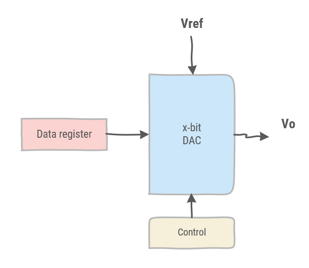
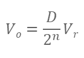
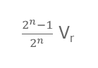
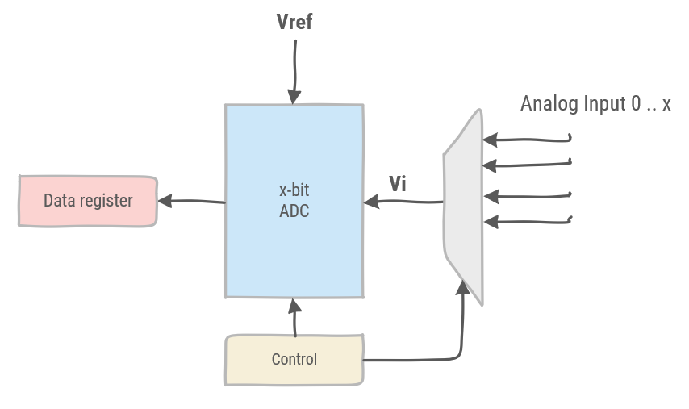
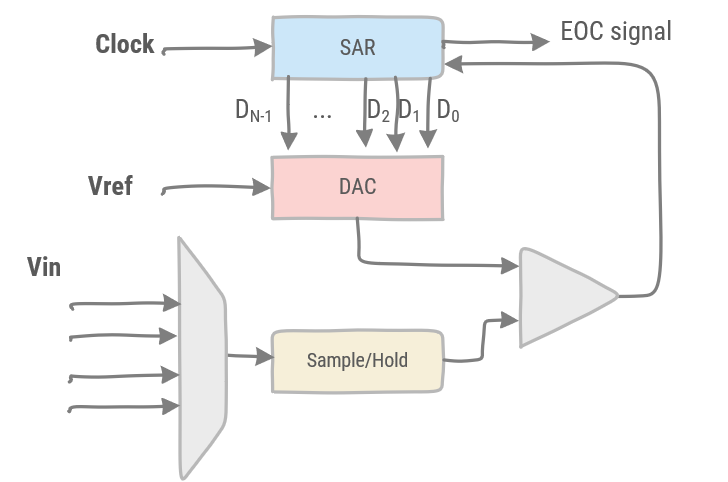
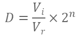
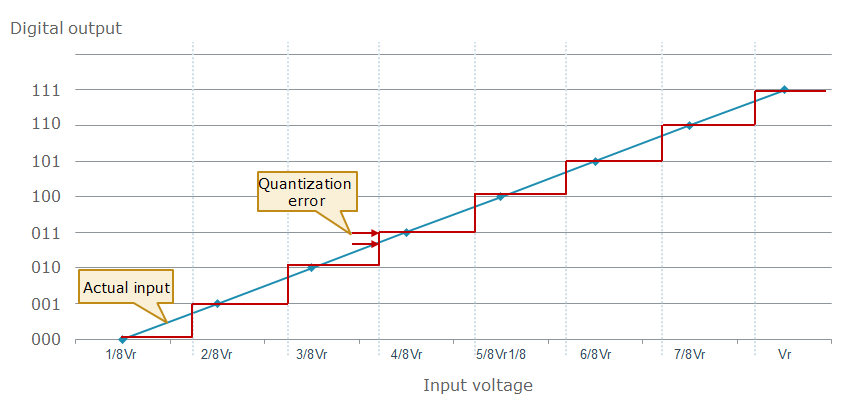
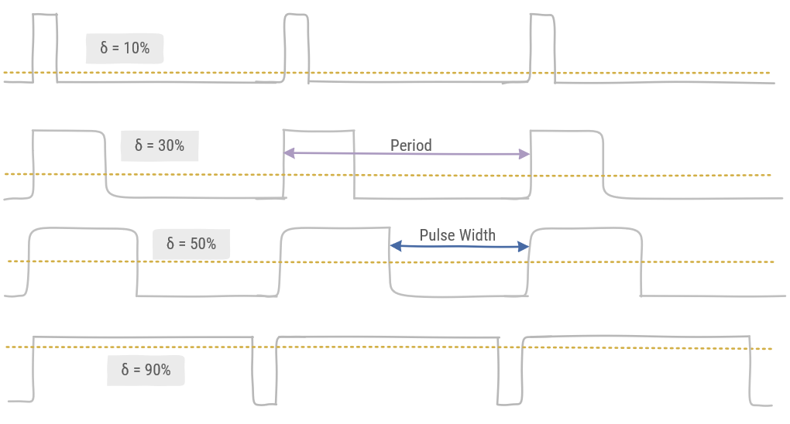

# Analog IO

A digital microcontroller interfaces with the analog world using specific peripherals called Analog-to-Digital Converters (ADC), and vice versa Digital-to-Analog Converters (DAC). Typically, most microcontrollers have one or more of these peripherals. Also, a digital means of interfacing with the analog world is also used widely, so called Pulse-Width Modulation (PWM).

## Digital-to-Analog Converter

DAC block diagram

Relation data - Vref formula

Maximum output voltage

## Analog-to-Digital Converter

ADC block diagram

Successive Approximation ADC (SAR) block diagram

ADC Range

Quantization error

Shannon Sampling Theorem

## Pulse-Width Modulation

PWM duty cycle

