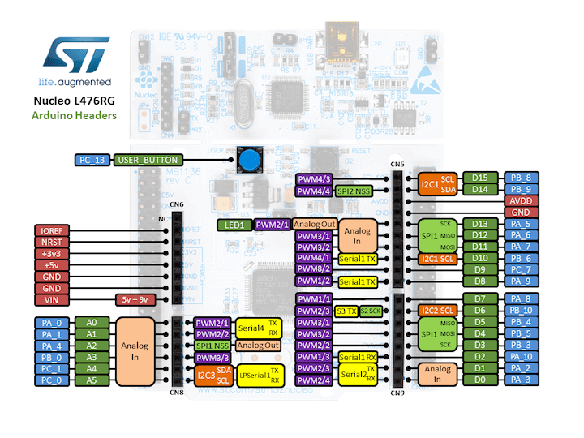
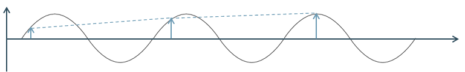
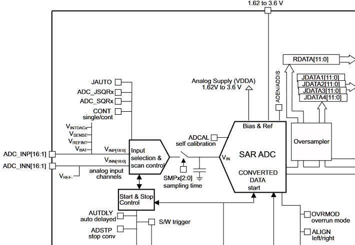

# Analog IO

> * What is a DAC?
> * What are important characteristics of Vref?
> * What is the relation between the digital value and the output voltage of a DAC?
> * What is the maximum output voltage of a DAC?
> * What is an ADC?
> * What does Shannon's sampling theorem determine?
> * What is the relation between the digital value and the input voltage of an ADC?
> * What is a quantization error?
> * How does a SAR ADC operate?
> * What is PWM?
> * What is the relation between frequency and duty cycle of a PWM signal?

A digital microcontroller interfaces with the analog world using specific peripherals called Analog-to-Digital Converters (ADC), and vice versa Digital-to-Analog Converters (DAC). Typically, most microcontrollers have one or more of these peripherals. Also, a digital means of interfacing with the analog world is also used widely, so called Pulse-Width Modulation (PWM).

## Digital-to-Analog Converter

A Digital-to-Analog converter converts a value (D) to a voltage (Vo). The digital value represents a fraction of a reference voltage (Vref). Depending on the number bits represented in the data register, the number of steps in the range between the reference voltage and ground is greater or smaller. This is also called the *resolution* of the DAC.


Figure 1: DAC block diagram.

The relation between the digital data and the reference voltage is represented in the following formula:


Equation 1: Relation between the digital value and Vref.

Given the number of bits used to represent the analog output voltage it follows that the range is between 0 and (2^n)-1. This means the maximum output voltage is a single bit less than the reference voltage, thus the reference voltage can never be achieved a the output of a DAC. This can be represented as:


Equation 2: Maximum output voltage.

The reference voltage of a DAC must be stable voltage in order to obtain a correct output voltage. Accuracy errors in components, temperature and long term drift are major factors which contribute to the accuracy of the reference circuit. Typically Zener-based, shunt or series reference are used.

The AnalogOut class of the Mbed library provides an interface to set the output voltage of an analog output pin. 

```cpp
AnalogOut dac(A2);

dac = 0.5;

```

Create an AnalogOut object on a pin which is connected to the internal DAC. Assigning a float value represents the fraction of Vref which is generated as Vout.



Figure 2: The AnalogOut pins can be found at A2 and D13 of the Nucleo Arduino header.

The STM32L476RG contains a 12-bit DAC module which has two output channels. These channels are effectively independent DACs.


Figure 3: DAC of the STM32L476RG

The DAC has a lot of features, which can be configured. However basically to generate an analog voltage only two registers are relevant. On the one hand the DAC_DOR is the digital data register, on the other hand the DAC_CR is the control register which contains the enable bit.

## Analog-to-Digital Converter

The Analog-to-Digital Converter converts an analog voltage to a digital value. In this respect the ADC could be viewed as the inverse of the DAC.


Figure 4: ADC block diagram

For economical reasons multiple analog input pins on the microcontroller are multiplexed to the ADC input signal (Vi). This way only a single ADC is needed to provide this functionality on multiple pins. The consequence of course is that converting multiple analog signals on these pins will effectively lower the maximum sample frequency, as conversion time for each pin is multiplied by the number of pins sampled.



Figure 5: Shannon Sampling Theorem

The minimum sampling frequency is determined by the Shannon Sampling Theorem, which states that in order to approximate a signal correctly it should be sampled at least twice in the period of the signal with the highest frequency. In other words, the sampling frequency should be twice the highest frequency of the signal. In figure 5 it is illustrated what could happen when the Shannon Sampling Theorem is not adhered to.

Similarly to a DAC, the ADC requires a stable reference voltage. This reference voltage determines the range of the ADC. Namely between, a voltage between ground and Vref. This is shown in the ADC conversion formula. 


Equation 3: ADC conversion formula

Converting an analog signal to a digital value will always yield a quantization error. This is an approximation error, in which the analog value is rounded to the voltage which corresponds with the digital value times the reference voltage. In other words, a single bit corresponds with a voltage range, which is the smallest range of voltage the ADC can measure. When plotted in a graph the of the reference voltage which is quantized in a binary value, will correspond to a stair function. When the actual voltage is plotted on top of this function, the difference between the actual value and the quantized value is the perpendicular between both lines. The largest gap between both functions represents the maximum quantization error. 


Figure 6: Quantization error

Many types of ADCs exist, yet the most common ADC in microcontrollers is the Successive Approximation Register ADC.


Figure 7: Successive Approximation Register ADC (SAR) block diagram

The SAR consists of a DAC, a sample/hold circuit and a register containing the binary value which represents the analog input voltage. 

First, the input voltage is fixed in the sample/hold circuit. This is important as through the entire conversion procedure this voltage must remain the same. The sample/hold circuit fixes a sample of the input voltage, so the voltage on the microcontroller input pin might vary during the conversion cycle.

Next, the voltage in the sample/hold circuit is compared to the output of the DAC, which will generate a specific voltage. The output of the comparator is then fed to the register, which in turn is used as input for the DAC. The idea is the following: initially the conversion value in the register has its most significant bit as a 1 and the rest 0's. For example, given a 4-bit DAC this would be 1000b. Thus the DAC will generate half of Vref, as given by equation 1. This Vout of the DAC is then compared to Vin in order to determine actual value of this binary digit. More specifically, two things can happen: either the input voltage is lower than half of Vref, or the input voltage is higher. In the first case, the most significant digit is set to 0 and in the latter case it is kept to 1. Either way, next the following bit is set in the register and the process repeats. 

A small example: given a 4-bit SAR and an input voltage equal to 0.63 Vref. These are the steps in the conversion process:

| Step | SAR value binary | DAC output| < Vin? |
|---|---| --- | --- |
| 1 | 1000 | 0.5 Vref | Yes |
| 2 | 1100 | (0.5 + 0.25) Vref | No |
| 3 | 1010 | (0.5 + 0.125) Vref | Yes |
| 4 | 1011 | (0.5 + 0.125 + 0.0625) Vref | No |

As the final step results in a voltage larger than Vin (0.6875 Vref > Vin), the least significant digit in the register becomes 0, producing 1010 as the final result. 

Finally an End Of Conversion (EOC) signal is generated. If the conversion value is read before the EOC signal has been generated, a partial result will be obtained, which is less accurate. As the steps are executed successively, the process requires a given conversion time in order to complete.

In the Mbed library the AnalogIn class provides the interface for the ADC.

A small example: 

```cpp
AnalogIn adc(A0);
adc.read();
```

The AnalogIn object is instantiated given a pin of the microcontroller which is connected to the ADC. The read method gives the percentage of the reference voltage which is sampled at the given pin.

Again, the ADC in the STM32L476RG has many features, which allow for a great flexibility. However, when focussing only on the most simple case of sampling a single input voltage, only a handful of registers are needed.



Figure 8: Part of the block diagram of the STM32L476RG ADC.

ADC_DR provides the output data register. The pin to sample is selected in the ADC_SQR register. The ADC_CR control register, starts conversion.

## Pulse-Width Modulation

Pulse-Width Modulation (PWM) is a technique which allows a digital signal to resemble as an analog signal if the load is not affected by fast discrete switching. Rather a 'slow' load will take the average of the PWM signal, rather than the fast digital output values. The frequency on which PWM operates to achieve this, depends entirely on the load. 

An example is dimming LEDs through PWM. The load in this case is the human eye, which is quite slow. In a digital signal of around 30 Hz the signal no longer appears to turn off or on, rather it will look as if the LED is continuously on, albeit dimmed. In a LED dimmer application the actual PWM frequency is chosen to be 120Hz. 

Other examples include electrical stoves, switching on/off several times per minute and electric motor drives switching at kHz. 

Switching off reduces current to 0, and switching on reduces the voltage drop to 0. Combined this results in minimal power loss, thus PWM is quite efficient.


Figure 9: PWM duty cycles

The average power in a PWM signal is determined by its duty cycle. The duty cycle, δ, is the percentage of the period in which the PWM signal is a '1'. For instance, a duty cycle of 50% means, half the time a '0', half the time a '1', which results in an average 50% power in the PWM signal. In figure 9 various PWM signals with different duty cycles are depicted. A duty cycle of 100% corresponds with a continuous '1' and likewise a duty cycle of 0% is continuously 0.

In the Mbed library the PWMOut class provides an interface for PWM signal generation.

A simple example: 

```cpp
PWMOut pwm(A0);
pwm.period_us(50);
pwm.write(0.5);
```

First a PWMOut object is created on the corresponding PWM pin. Next, a period is selected. It has other period methods for different ranges. Finally, the duty cycle is selected by the write method.

:::tip
It is possible to generate a PWM signal with a GPIO pin, letting the processor do all the switching. However, a Timer component will do this more efficiently and also has more features, like synchronization, phase shifting, dead-time insertion in a H-bridge configuration, etc. 
:::
