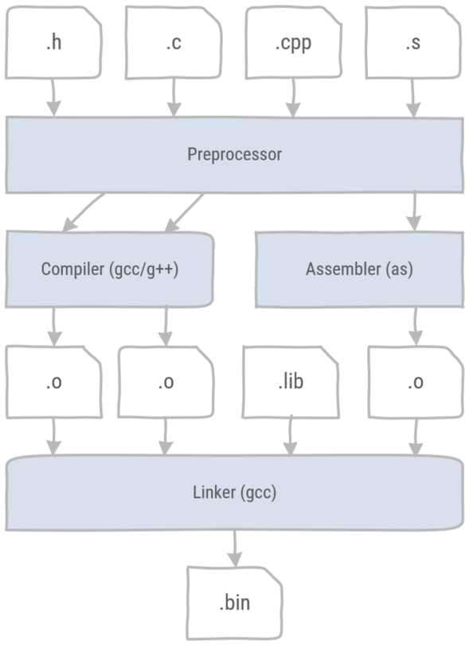

# C++

C is the most popular language to develop embedded software. C++ is often considered a superset of C, but this is not strictly true. 
However, a subset of C++ can be used to write efficient and safe embedded software. Many C++ compilers support microcontroller architectures, for instance the [GNU Arm Embedded toolchain](https://developer.arm.com/tools-and-software/open-source-software/developer-tools/gnu-toolchain/gnu-rm) contains the arm-none-eabi-g++ compiler, an open source C++ compiler for ARM Cortex M and ARM Cortex R targets.

## Compiler toolchain

To understand building C/C++ projects, it is necessary to learn about the different tools in the compilation toolchain. 



Figure 1: The C/C++ compiler toolchain consists of the preprocessor, the compiler, the assembler and the linker.

1. Source files can be categorized by file extension.
    * Header (.h) files are files containing declarations for C or C++ source files. These are typically included in the source files with the **#include** directive.
    * Source (.c and .cpp) files are the source code files for C and C++ respectively. Note that C++ files might have different file extensions.
    * Assembler (.s) files are files containing assembler code. Note that assembler files might have different file extensions.
2. All files are preprocessed by the preprocessor. This is a tool which does copy/paste as instructed by the preprocessor directives. For example the **#include** directive literally copy and pastes a file into the place where the directive is found. Other useful directives are **#define**, **#ifdef #endif**, **#ifndef #endif**.
    * **#define** sets a preprocessor variable in a source file. These variables can also be be included in the compilation command.
    * **#ifdef #endif** defines a preprocessor block which is only included if the preprocessor variable has been defined.
    * **#ifndef #endif** defines a preprocessor block which is only included if the preprocessor variable has not been defined.

    These directives are typically included as a guard for header files. To use declarations in different source files, headers can be included multiple times. As the **include** directive performs a copy/paste operation including a header file multiple times, will result in multiple declarations errors. The following code snippet defines a block which can only be included once in the compilation process.
    ```cpp
    //start of the .h file
    #ifndef NAME_OF_HEADER_FILE
    #define NAME_OF_HEADER_FILE

    // header file declarations

    #endif
    //end of file
    ```
3. The compiler or assembler translates the human readable code which has been preprocessed to produce binary files called object files (.o). For each source files a corresponding object file is created.
4. The linker then takes all object files, including any pregenerated library files (.lib) and merges them into a single binary (.bin) file. Note that file extensions can differ. Actually when referring to a function in a source file, the compiler leaves the address of the function blank, until the linker decides where to put all the code. It then generates the correct addresses for the function calls.

## Bit Manipulation

Dealing with registers, bits are often set, cleared, toggled and shifted. C/C++ does not offer a *bit* data type, however it is possible to perform these tasks using bitwise operations. 

## Pointers

### By value or by reference


