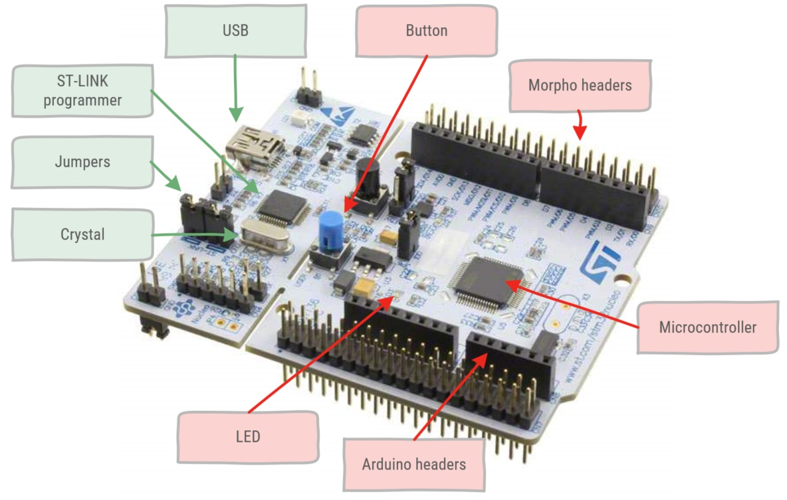
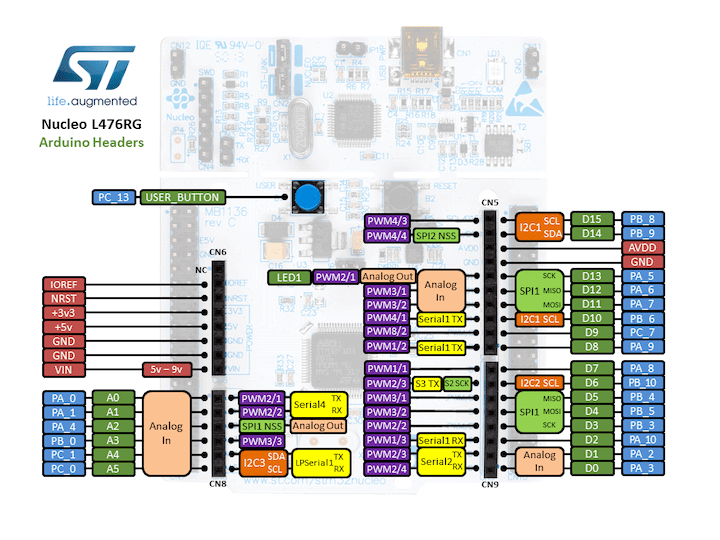
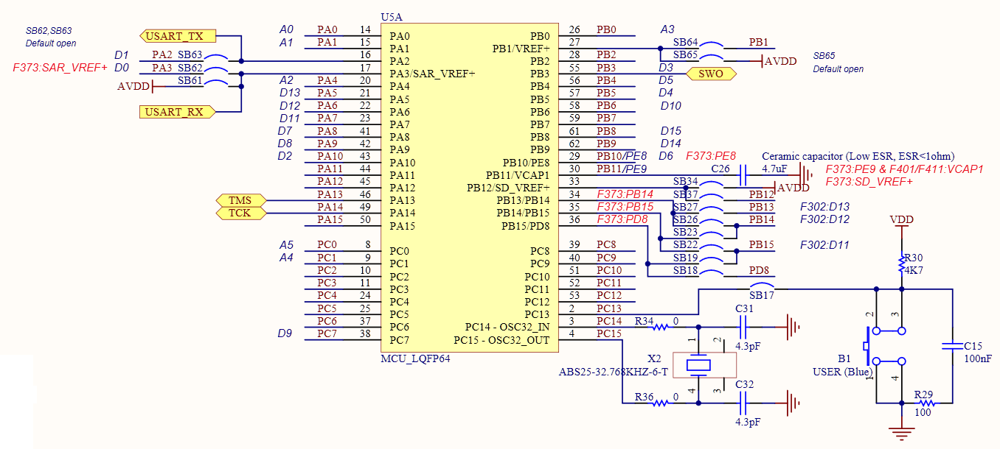
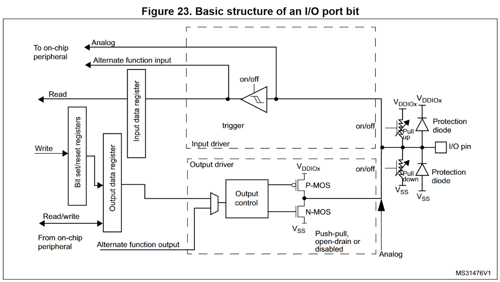
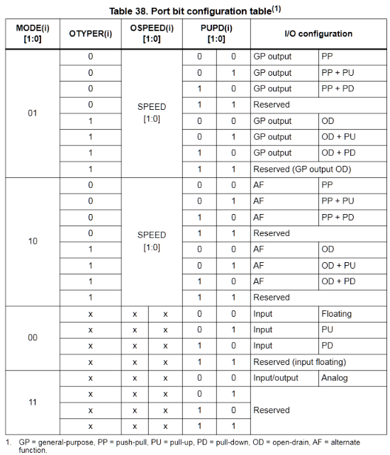
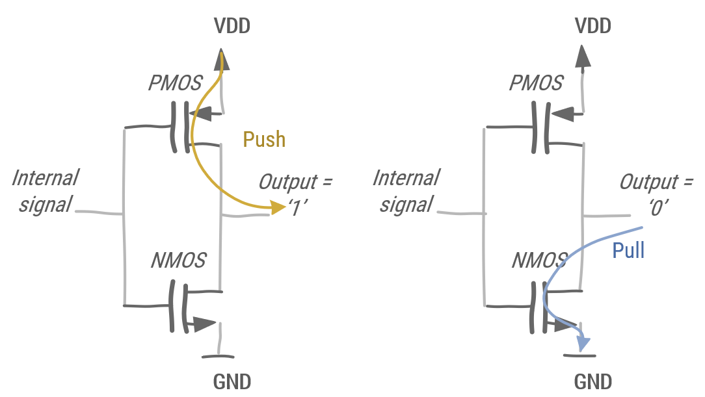
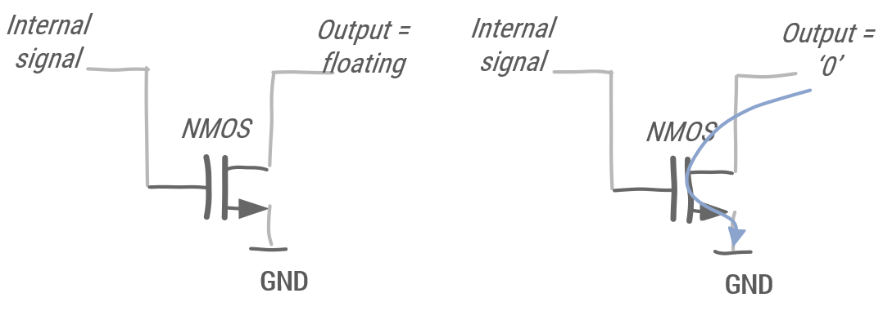

# Digital IO

> * What is a typical microcontroller board layout?
> * What is the difference between Push-Pull and Open Drain?
> * What are the GPIO registers?
> * How are I/O modules mapped onto memory addresses?
> * How can memory-mapped registers be addressed?
> * How can GPIO be set up?
> * How are peripherals organized in data structures?
> * What is the purpose of **volatile**?
> * How can you make the microprocessor wait?
> * How to debounce input switches?

## Nucleo board



Figure 1: components on the Nucleo L476RG microcontroller board.

The microcontroller board actually consists of two microcontrollers. The ST-LINK (green labels) programmer microcontroller provides an on-board programmer module for the STM32L476RG microcontroller (red labels). More information can be found in the [UM1724 User Manual](https://www.st.com/content/st_com/en/products/evaluation-tools/product-evaluation-tools/mcu-mpu-eval-tools/stm32-mcu-mpu-eval-tools/stm32-nucleo-boards/nucleo-l476rg.html#resource).

* ST-LINK
  * Programmer: microcontroller providing USB communication to load the binary to the STM32L476RG microcontroller user flash. This is called In-System Programming. It also allows writing data into RAM. This allows for Serial Wire Debug (SWD). This is a protocol based on JTAG, a software/hardware interface for debugging.
  * USB: mini-USB interface.
  * Jumpers: are two or more pins which can be shorted by a jumper. These are used for hardware configuration settings. Connecting certain parts when a jumper is present or disconnecting them when the jumper is removed.
  * Crystal: Provides a clock signal for the programmer microcontroller.
* STM32L476RG
  * LED: SMD user LED (set as a digital output)
  * Button: joystick (used as a digital input)
  * Arduino headers: physical connection to pins which follows the Arduino layout.
  * Morpho headers: physical connection to pins which follows the Morpho layout.



Figure 2: Arduino header pinout.


Figure 3: Morpho header pinout.

I/O modules are mapped onto memory addresses, so that a given bit corresponds to the value on the physical pin 
Writing to or reading from these addresses corresponds to writing to or reading from the physical pins
Physical pins are mapped onto ports: for instance PA_0 reads as port A pin 0.

Many pins are mapped onto multiple peripherals, for instance PA_0 is used for GPIO, Analog In, PWM2/1, Serial4 Tx. In a register the pin function is selected. A pin can only have 1 actual purpose. The reason is economical, frankly the cost of wiring a physical pin into a microcontroller chip is determinative for the total cost of the chip. Therefore multiple functions are mapped onto the same physical pins. 


Figure 4: The Intel 4004, the first microprocessor by Intel (1971 AD) chip die with wiring connections at the edge.



Figure 5: Microcontroller part of the Nucleo L476RG ([MB1136 schematics](https://www.st.com/content/st_com/en/products/evaluation-tools/product-evaluation-tools/mcu-mpu-eval-tools/stm32-mcu-mpu-eval-tools/stm32-nucleo-boards/nucleo-l476rg.html#resource)). This is a good reference design for using the microcontrollers, notice the crystal, capacitances and resistors.

## GPIO

In digital devices, logic values ‘1’ or ‘0’ are represented as electrical voltages. Different devices may use different voltages to represent a logic value.

Normally, the external pins are not directly accessible, but accessed via a peripheral called General-Purpose Input/Output (GPIO). More information can be found in the [RM0351 Reference Manual](https://www.st.com/content/st_com/en/products/evaluation-tools/product-evaluation-tools/mcu-mpu-eval-tools/stm32-mcu-mpu-eval-tools/stm32-nucleo-boards/nucleo-l476rg.html#resource) chapter 8.



Figure 23: Source RM0351 Rev 6 page 295.



Table 38: Source RM0351 Rev 6 page 296.

Each pin is configurable in three ways, (1) selecting its function, (2) Push-Pull or Open Drain configuration, (3) floating or resistors.

1. General Purpose (GP) or Alternate Function (AF)
    1. Push-Pull (PP) or Open Drain (OD)
        * Floating (no internal resistor)
        * Internal Pull-up
        * Internal Pull-down



Figure 6: Push-Pull configuration.

In Push-Pull either the PMOS is driven to produce a '1' or the NMOS is driven to produce a '0'. Push-Pull does not allow multiple devices to be connected. Push-Pull is mostly used with devices which require a unidirectional line. As Push-Pulls are driven, they have produce steeper slopes. When both transistors are driven, the pin becomes high impedant, and becomes an input.



Figure 7: Open-Drain configuration.

In Open-Drain, when the NMOS is not driven, the output is floating. When the NMOS is driven it produces a '0'. Open-Drain allows multiple devices to be connected on a single bus. Pull-up are used to provide the voltage when the NMOS is not driven. In an Open-Drain configuration the rising slope is not as steep. When choosing the value of the pull-up resistor, a trade-off has to be considered. Namely, if the resistor value is low, the slope will be steeper, but requires more power. Choosing a higher resistor value, the slope is less steep, but the power consumption is also down.

### GPIO ports

The STM32L476RG has 8 ports (A-H), which contain 16 bits each. Almost every pin on the microcontroller can be configured as GPIO, however, not every bit in a GPIO port is connected to a pin. The memory address can be of the peripherals can be found in the [STM32L476xx data sheet](https://www.st.com/en/microcontrollers-microprocessors/stm32l476rg.html) Table 19 page 108 - 111.

Each peripheral is connected to the peripheral bus. As a peripheral, a GPIO port must be enabled on the peripheral bus controller. The STM32L476RG has 5 peripheral bus controllers (AHB 1-3 and APB 1-2). More information can be found in the RM0351 Reference Manual in chapters 6.4.16 to 6.4.21.

### GPIO registers

When the microcontroller is reset all registers are set at their default value. Some registers are read only or write only. Each register is at a specific offset of the base peripheral address, this is important to write generic drivers for similar peripherals, i.e. a single driver for all GPIO ports.

The GPIO registers in the STM32L476RG are the following:

* GPIO port mode register: selects input, output, alternate function or analog mode (which is the default).
* GPIO port output type register: selects push-pull (default) or open-drain.
* GPIO port output speed register: low (default for most), medium, high or very high speed.
* GPIO port pull-up/pull-down register: floating (default for most), pull-up or pull-down.
* GPIO port input data register (read only): read the value on the input from this register.
* GPIO port output data register: write to this register, to set or reset the pin. However, it is advised to use the bit set/reset register, to perform atomic set/reset operations.
* GPIO bit set/reset register (write only): atomic set/reset of a bit.
    :::warning
    It is safer to use the bit set/reset register, rather than the output register. An atomic set/reset cannot be interrupted. However it is limited to setting or resetting a single bit per operation.
    :::
* GPIO port configuration lock register: locks the corresponding bits of the configuration registers until the microcontroller or the peripheral resets.
* GPIO alternate function low and high registers: selects the alternate function.
* GPIO port bit reset register (write only): resets the corresponding bit.
* GPIO port analog switch control register: disconnect the analog switch (default state), or connect the switch to the ADC input.

### Example

This is the full low-level blinking led example on the NUCLEO-L476RG board. A more detailed explanation is given below.

```cpp
// includes low level peripheral definitions
#include "stm32l476xx.h"

/**
 * Waits for an approximate number of milliseconds, this function blocks the CPU
 * 
 * @param milliseconds to wait
 */
void approx_wait(uint32_t milliseconds)
{
    for (uint32_t j = 0; j < milliseconds; j++)
    {
        for (volatile uint32_t i = 0; i < 4000; i++)
            ;
    }
}

int main()
{
    //Green led of the NUCLEO-L476RG is connected to PA5
    //Enable GPIOA peripheral in the AHB2ENR: set bit 0
    RCC->AHB2ENR |= 1;

    // GPIOA_MODER set GP output mode for PA5: reset bit 11 & set bit 10
    GPIOA->MODER &= ~(1<<11);
    GPIOA->MODER |= 1 << 10;

    // GPIOA_OTYPER pushpull: default after reset
    // GPIOA_OSPEEDR low speed: default after reset
    // GPIOA_PUPDR no pull-up / no pull-down: default after reset

    while (true)
    {
        //GPIOA_BSRR set PA5: set bit 5
        GPIOA->BSRR |= 1<< 5;
        approx_wait(500);
        //GPIOA_BSRR reset PA5: set bit 21
        GPIOA->BSRR |= 1 << 21;
        approx_wait(500);
    }
}
```

The *stm32l476xx.h* header file contains all low-level microcontroller specific definitions. These are the names of the peripheral's registers.Each peripheral in the microcontroller has its own **struct**. The arrow operator selects the register within the peripheral. For instance ```GPIOA->MODER```, GPIOA is the peripheral and MODER is its MODE register. 

The *approx_wait* function is basically an empty for-loop to keep the processor busy. This is not an efficient way to program a microcontroller, but it works for our purposes. The value 4000 in the inner loop is related to the processor clock frequency. Each instruction to make a for-loop requires a clock cycle to execute. 4000 cycles in this for-loop takes about 1 millisecond. This must be verified and fine-tuned with an oscilloscope. Toggle a pin given a number of wait cycles and check if the corresponding timing is within the acceptable values.

::: tip
As the for-loop is empty, the compiler might decide to optimize the function. Of course this is not desirable for the *approx_wait*, as its sole purpose is to keep the processor from doing something useful. To signal the compiler this function may not be optimized the **volatile** keyword is used on the innermost loop variable. This keyword tells the compiler every instruction involving this variable must be executed.

**volatile** is also used to define each of the peripheral registers. If the processor does not change a variable, it is not required to read it again. However, a register can be changed from the peripheral, thus subsequent read operations by the processor might yield different results.
:::

The main function can be divided in initialization code before the while loop and using the GPIO within the while loop. First the GPIOA peripheral must be enabled in the peripheral bus controller register. The position of the corresponding bit with the peripheral can be found in the RM0351 Reference Manual page 252.

::: warning
Trying to write to or read from registers before the peripheral has been enabled will not work.  
:::

Then the pin is set as Digital Output. This must be done in the MODE register. Other registers can be configured as well, but the default values suit the example fine. More information in the RM0351 Reference Manual pages 303-306.

Finally, the Bit Set and Reset register is used to control the behavior of the pin.

::: warning
Output high requires writing a '1' in the corresponding bit of the register. Output low also requires writing a '1' in another bit of the register. After, the voltage level on the pin has changed, the '1' bit in the register is automatically cleared.  
:::

### Mbed Digital I/O

The Mbed library provides three classes for digital I/O on pin level, namely [DigitalOut](https://os.mbed.com/docs/mbed-os/v6.15/apis/digitalout.html), [DigitalIn](https://os.mbed.com/docs/mbed-os/v6.15/apis/digitalin.html) and [DigitalInOut](https://os.mbed.com/docs/mbed-os/v6.15/apis/digitalinout.html).

A simple example:

```cpp
#include "mbed.h"

int main()
{
    // Creates a DigitalOut object and connects it to the pin with name LED1
    DigitalOut led(LED1);
           
    // Writing 1 will put the DigitalOut pin at a logical high level (e.g. 3V3)
    led.write(1);
    ThisThread::sleep_for(500ms);

    // Writing 0 will put the DigitalOut pin at a logical low level (e.g. GND)
    led.write(0);     
    ThisThread::sleep_for(500ms);
           
    // Shorthand notation for led.write(1);
    led = 1;
    

    while (true) {
        // Shorthand notation for led.write(!led.read());
        led = !led;
        ThisThread::sleep_for(500ms);
        
    }
}
```
