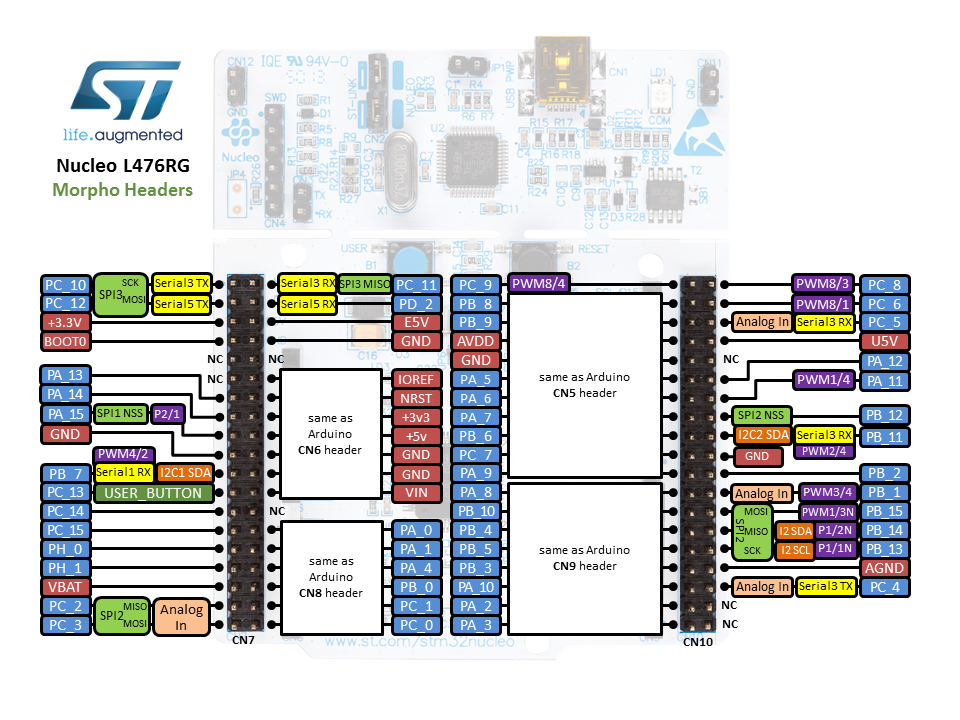

# Digital IO

> * What is a typical microcontroller board layout?
> * What is the difference between Push-Pull and Open Drain?
> * What are the GPIO registers?
> * How are I/O modules mapped onto memory addresses?
> * How can memory-mapped registers be addressed?
> * How can GPIO be set up?
> * How are peripherals organized in data structures?
> * What is the purpose of **volatile**?
> * How can you make the microprocessor wait?

> * How to debounce input switches?

## Nucleo board

Figure 1: components on the Nucleo L476RG microcontroller board.

The microcontroller board actually consists of two microcontrollers. The ST-LINK (green labels) programmer microcontroller provides an on-board programmer module for the STM32L476RG microcontroller (red labels). More information can be found in the [UM1724 User Manual ](https://www.st.com/content/st_com/en/products/evaluation-tools/product-evaluation-tools/mcu-mpu-eval-tools/stm32-mcu-mpu-eval-tools/stm32-nucleo-boards/nucleo-l476rg.html#resource).

* ST-LINK
    * Programmer: microcontroller providing USB communication to load the binary to the STM32L476RG microcontroller user flash. This is called In-System Programming. It also allows writing data into RAM. This allows for Serial Wire Debug (SWD). This is a protocol based on JTAG, a software/hardware interface for debugging.
    * USB: mini-USB interface.
    * Jumpers: are two or more pins which can be shorted by a jumper. These are used for hardware configuration settings. Connecting certain parts when a jumper is present or disconnecting them when the jumper is removed.
    * Crystal: Provides a clock signal for the programmer microcontroller.
* STM32L476RG
    * LED: SMD user LED (set as a digital output)
    * Button: joystick (used as a digital input)
    * Arduino headers: physical connection to pins which follows the Arduino layout.
    * Morpho headers: physical connection to pins which follows the Morpho layout.

Figure 2: Arduino header pinout.

Figure 3: Morpho header pinout.

I/O modules are mapped onto memory addresses, so that a given bit corresponds to the value on the physical pin 
Writing to or reading from these addresses corresponds to writing to or reading from the physical pins
Physical pins are mapped onto ports: for instance PA_0 reads as port A pin 0.

Many pins are mapped onto multiple peripherals, for instance PA_0 is used for GPIO, Analog In, PWM2/1, Serial4 Tx. In a register the pin function is selected. A pin can only have 1 actual purpose. The reason is economical, frankly the cost of wiring a physical pin into a microcontroller chip is determinative for the total cost of the chip. Therefore multiple functions are mapped onto the same physical pins. 

Figure 4: The Intel 4004, the first microprocessor by Intel (1971 AD) chip die with wiring connections at the edge.

Figure 5: Microcontroller part of the Nucleo L476RG ([MB1136 schematics](https://www.st.com/content/st_com/en/products/evaluation-tools/product-evaluation-tools/mcu-mpu-eval-tools/stm32-mcu-mpu-eval-tools/stm32-nucleo-boards/nucleo-l476rg.html#resource)). This is a good reference design for using the microcontrollers, notice the crystal, capacitances and resistors. 

## GPIO

In digital devices, logic values ‘1’ or ‘0’ are represented as electrical voltages. Different devices may use different voltages to represent a logic value.

Normally, the external pins are not directly accessible, but accessed via a peripheral called General-Purpose Input/Output (GPIO). More information can be found in the [RM0351 Reference Manual](https://www.st.com/content/st_com/en/products/evaluation-tools/product-evaluation-tools/mcu-mpu-eval-tools/stm32-mcu-mpu-eval-tools/stm32-nucleo-boards/nucleo-l476rg.html#resource) chapter 8.

Figure 23: Source RM0351 Rev 6 page 295.

Table 38: Source RM0351 Rev 6 page 296.

Each pin is configurable in three ways, (1) selecting its function, (2) Push-Pull or Open Drain configuration, (3) floating or resistors.

1. General Purpose (GP) or Alternate Function (AF)
    1. Push-Pull (PP) or Open Drain (OD)
        * Floating (no internal resistor)
        * Internal Pull-up
        * Internal Pull-down

Figure 6: Push-Pull configuration.

In Push-Pull either the PMOS is driven to produce a '1' or the NMOS is driven to produce a '0'. Push-Pull does not allow multiple devices to be connected. Push-Pull is mostly used with devices which require a unidirectional line. As Push-Pulls are driven, they have produce steeper slopes. When both transistors are driven, the pin becomes high impedant, and becomes an input.

Figure 7: Open-Drain configuration.

In Open-Drain, when the NMOS is not driven, the output is floating. When the NMOS is driven it produces a '0'. Open-Drain allows multiple devices to be connected on a single bus. Pull-up are used to provide the voltage when the NMOS is not driven. In an Open-Drain configuration the rising slope is not as steep. When choosing the value of the pull-up resistor, a trade-off has to be considered. Namely, if the resistor value is low, the slope will be steeper, but requires more power. Choosing a higher resistor value, the slope is less steep, but the power consumption is also down.

### GPIO ports

The STM32L476RG has 8 ports, which contain 16 bits each. Almost every pin on the microcontroller can be configured as GPIO, however, not every bit in a GPIO port is connected to a pin. The memory address can be of the peripherals can be found in the [STM32L476xx data sheet](https://www.st.com/en/microcontrollers-microprocessors/stm32l476rg.html) Table 19 page 108 - 111.

### GPIO registers

When the microcontroller is reset all registers are set at their default value. Some registers are read only or write only. Each register is at a specific offset of the base peripheral address.

The GPIO registers in the STM32L476RG are the following:

* GPIO port mode register: selects input, output, alternate function or analog mode (which is the default).
* GPIO port output type register: selects push-pull (default) or open-drain.
* GPIO port output speed register: low (default for most), medium, high or very high speed.
* GPIO port pull-up/pull-down register: floating (default for most), pull-up or pull-down.
* GPIO port input data register (read only): read the value on the input from this register.
* GPIO port output data register: write to this register, to set or reset the pin. However, it is advised to use the bit set/reset register, to perform atomic set/reset operations.
* GPIO bit set/reset register (write only): atomic set/reset of a bit.
    :::warning
    It is safer to use the bit set/reset register, rather than the output register. An atomic set/reset cannot be interrupted. However it is limited to setting or resetting a single bit per operation.
    :::
* GPIO port configuration lock register: locks the corresponding bits of the configuration registers until the microcontroller or the peripheral resets.
* GPIO alternate function low and high registers: selects the alternate function.
* GPIO port bit reset register (write only): resets the corresponding bit.
* GPIO port analog switch control register: disconnect the analog switch (default state), or connect the switch to the ADC input.
