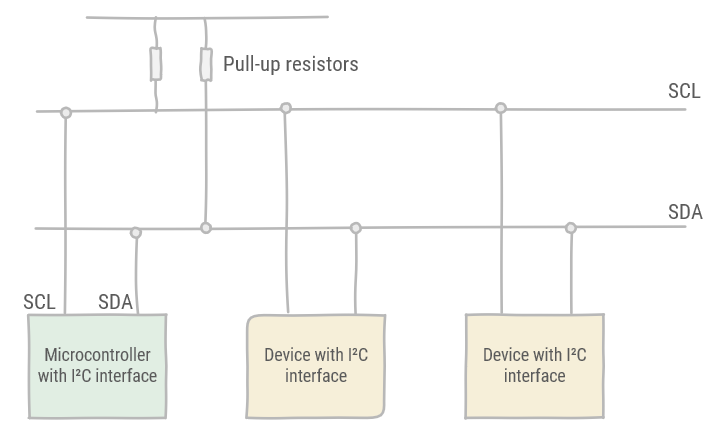
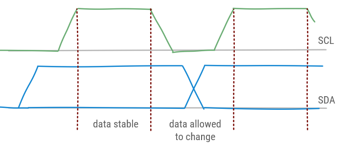
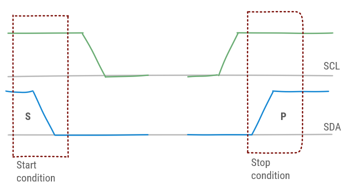
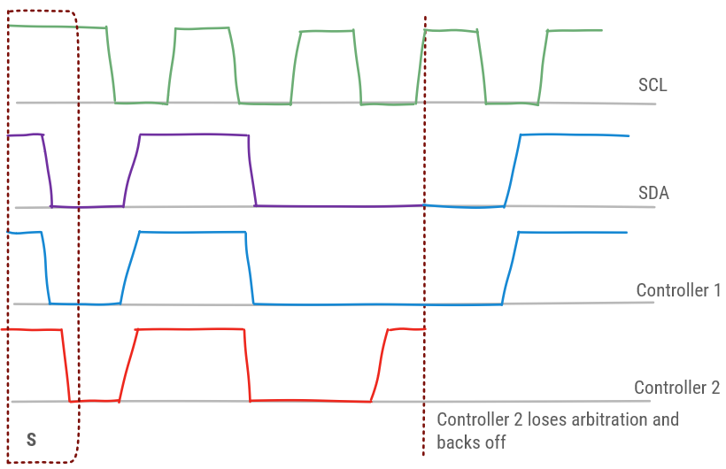
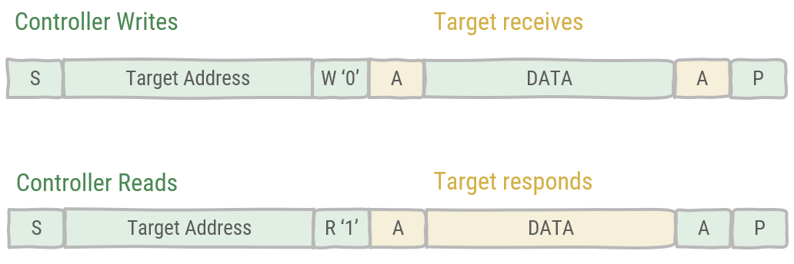

# I²C

Inter-Integrated Circuit (I²C) is a serial communication standard by Philips, which became widely used in the industry. It's a two-wired, synchronous, bi-directional, multi-controller bus. It is used to communicate between microcontrollers and peripherals in short-distance communication, either on a the PCB or between multiple PCB's.

## Physical layer

The I²C bus consists of two lines, Serial Data line (SDA) and Serial Clock Line (SCL). These lines are used in an open-drain configuration, i.e. all devices connect to the I²C bus with an Open Drain pin, which allows them to draw the line to ground, signalling a `0`. External pull-up resistors are provided for the default `1` state.

The number of devices using the I²C bus is limited to their capacitive influence on the lines. Namely, I²C has a device count limit of 400 pF. 

A number of rules govern the usage of the bus. While SCL is high, data on SDA is valid and may not change. While SCL is low, data can be changed on SDA, thus then it may not be read.

Two exceptions to this rule exist, signifying special conditions in I²C communication.

* **S**: Start condition (indicating the start of a frame): SDA changes from `1` to `0` while the SCL is high.
* **P**:Stop condition (indicating the end of a frame): SDA changes from `0` to `1` while the SCL is high.

The state of the bus is known as *busy* after **S** before **P** and *free* after **P** before **S**.

## Bus arbitration

The I²C bus is arbitrated by Carrier Sense Multiple Access with Bitwise Arbitration (CSMA/BA). This principle works on the Open Drain configuration which functions as a so-called wired AND.

If multiple controllers try to send, this will not lead to a conflict as long as they agree to send the same data. As soon as one of the controllers tries to send a `1` while one of the other controllers sends a `0` this will result in a `0` on the bus. The controller trying to send a `1` will notice this and back off from further communication.

## Data transfer

An I²C data frame consists of 8 bits + and acknowledge bit. A controller will initiate communication by using the start condition, then it proceeds by sending a 7-bit. 10-bit addressing exists, but is rarely used. Next, the controller will indicate whether it is a Read operation or a Write operation. After this the addressed target will acknowledge. Depending on whether a Read or Write was announced, one of two things will happen:

* In case of a Write: the controller will send a data frame, which will be acknowledged by the target.
* In case of a Read: the target will send a data frame, which will be acknowledged by the controller.

The general call address (0x00) is for addressing every device on the bus at the same time. Each device who wants to respond, acknowledges. As the bus is shared, the controller does not know how many devices responded. Also, later in communication when less devices acknowledge, this will be unknown to the controller.

I²C has been improved with higher data transfer rates. An overview:

| Mode | Maximum speed (kb/s) | Maximum capacitance (pF) |
| --- | --- | --- |
| Standard Mode | 100  | 400 |
| Fast Mode | 400 | 400 |
| Fast Mode plus | 1000 | 550 |
| High-speed Mode | 1700 | 400 |
| High-speed Mode | 3400 | 100 |

:::tip Ultra-Fast mode
An Ultra-Fast mode of 5000 kb/s also exists, but this fundamentally changes I²C. The bus becomes unidirectional, write-only allowing only a single controller and does not longer operate on Open Drain drives, but rather uses Push-Pull.
:::