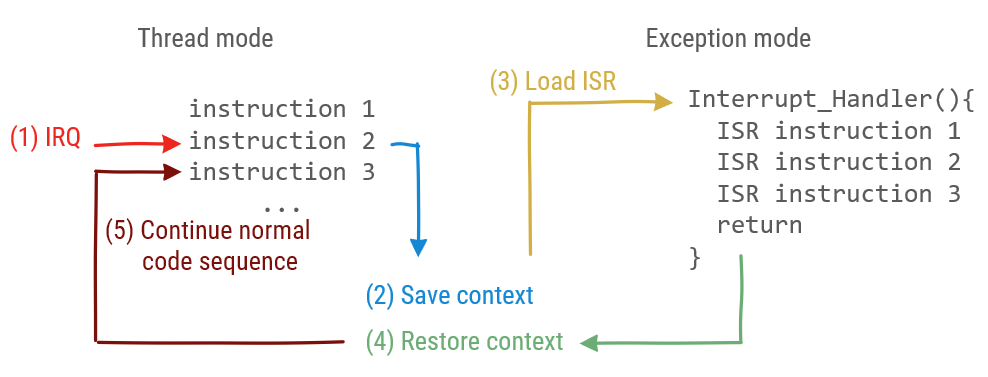
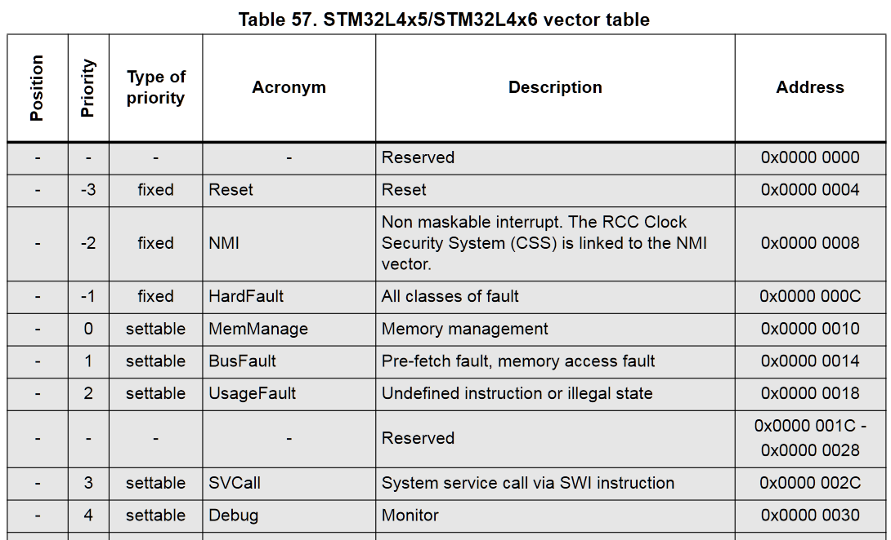
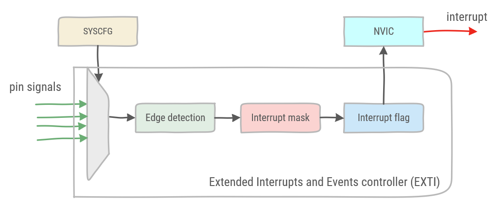
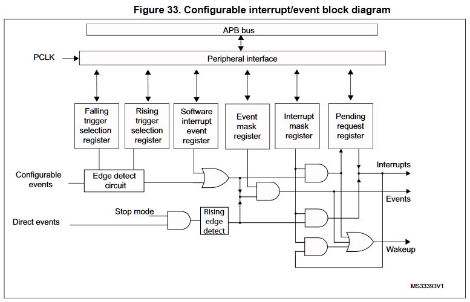
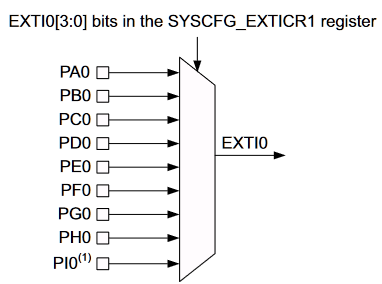
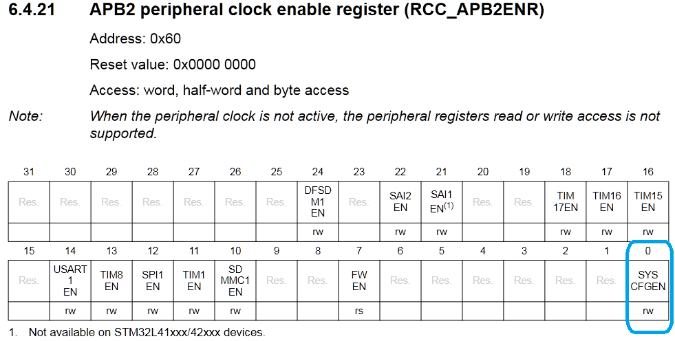
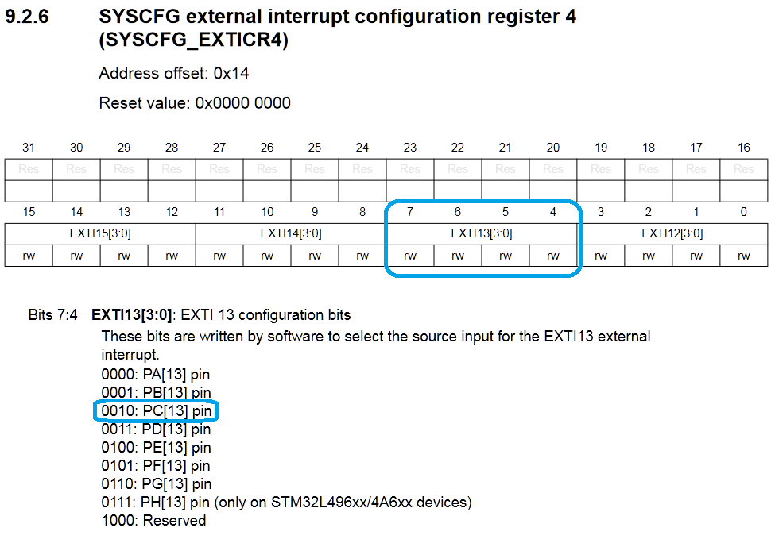
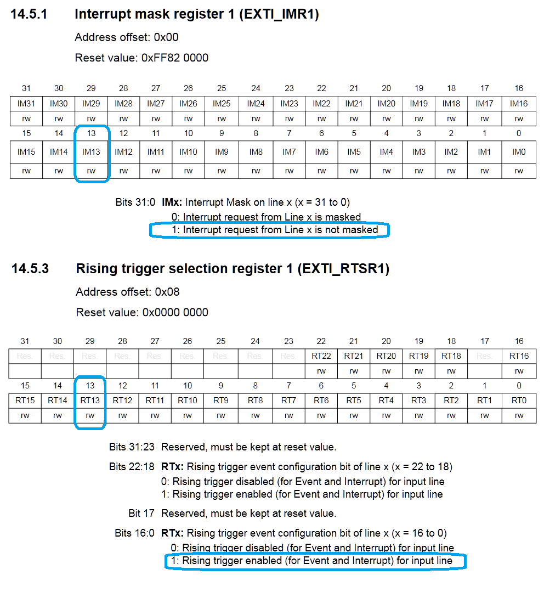
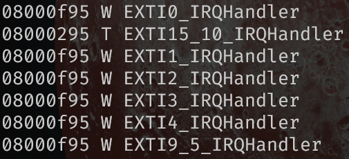
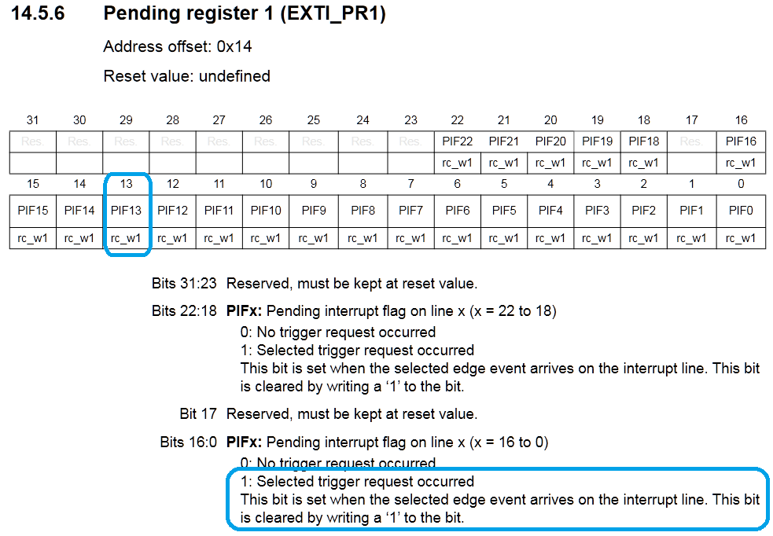

# Interrupts


In the previous example, the processor is continuously checking whether the interrupt flag has been set. This is not an efficient use of processor cycles. In an ideal world, the processor would be spending its processing cycles on something else and would be notified when the timer is done.

An external signal which notifies the processor, is called an interrupt. Rather than synchronously checking the interrupt flag, the interrupt signal will interrupt the processor, executing a special function called the Interrupt Service Routine (ISR) or interrupt handler. After the ISR has been executed, the program counter of the processor branches back to the instruction that has been interrupted, to continue its execution.

:::tip
Interrupts are not exclusively used by timers. In fact, any hardware peripheral in the microcontroller uses interrupts to offload the processor.
:::

There is a distinction between instructions executed in thread mode and instructions executed in exception mode. Thread mode is normal processor operation. Exception mode is used to execute code related to an exception. Interrupts are a specific type of exceptions. The reset signal, internal problems in the microcontroller (hardfaults), or memory management faults also cause an exception and are not considered to be interrupts. Each peripheral has its own interrupt to distinguish between interrupts.

When an Interrupt Request (IRQ) event occurs the interrupt flag is raised. Then, the processor saves the context. This is similar to what happens when a function is called. Keep in mind, the context consists the program counter and other registers.

Next, the program counter is loaded with the address of the Interrupt Service Routine (ISR), also known as the interrupt handler. When the interrupt handler is finished, the context which was interrupted is restored before continuing normal operation in thread mode. In the interrupt handler software is responsible for clearing the interrupt flag.



The Nested Vectored Interrupt Controller (NVIC) is the hardware responsible for handling interrupts for the processor. More specifically masking interrupts, setting priority and loading the program counter with the correct address. Interrupts have to be enabled individually in the NVIC.

:::tip
Every exception has a priority. Interrupts with a lower priority cannot interrupt the exception handler of an exception with a higher priority. Table 57 of the RM0351 gives an overview of all exceptions and their priority. The priority of most exceptions can be changed. Note: Non Maskable Interrupts are interrupts related to safety-critical code. These cannot be interrupted even by hardware errors of the microcontroller itself.


:::

## Timer example (with interrupts)

In order to enable interrupts in our previous example, two peripherals must enable interrupt generation. Namely the NVIC and the peripheral generating the interrupt. These are added to the function initializing timer 7.

```cpp
void tim7_init(){
    //Enable TIM7 in the APB1ENR1: set bit 5
    RCC->APB1ENR1 |= 1 << 5;

    // Enable the global interrupt for TIM7 in NVIC
    NVIC_EnableIRQ(TIM7_IRQn);

    // Given a clock of 48MHz, set prescaler and count register for a period of 1s
    TIM7->PSC = 1999;
    TIM7->ARR = 23999;

    // Set event generation, 
    // re-initializes timer counter
    // and generates an update of the registers
    TIM7->EGR |= 1;

    // Enable interrupt in TIM7
    TIM7->DIER |= 1;
}
```

Next, the code in the loop is moved to the interrupt handler. The interrupt handler of timer 7 must be placed at the address in the program memory associated with it. This address will be loaded by the NVIC when the interrupt signal is raised.

:::tip
Fortunately, in the startup code of the microcontroller, all interrupt handlers have already been defined at the correct program memory addresses. These are functions which have been weakly defined.

A weak definition of a function means that the compiler will replace the symbol in the progam's symbol table if a non-weak function with the same name is also defined. The non-weak function definition takes precedence over the weak function definition. Instead the non-weak definition takes its place in the program memory.

To discover which symbols have already been defined in a binary, a Linux cli tool such as **nm** can be used. **W** means the symbol is weakly defined, **T** indicates a non-weak definition of the symbol.

```bash
$ nm tim7.elf
--partial output
08000f89 W TIM1_BRK_TIM15_IRQHandler
08000f89 W TIM1_CC_IRQHandler
08000f89 W TIM1_TRG_COM_TIM17_IRQHandler
08000f89 W TIM1_UP_TIM16_IRQHandler
08000f89 W TIM2_IRQHandler
08000f89 W TIM3_IRQHandler
08000f89 W TIM4_IRQHandler
08000f89 W TIM5_IRQHandler
08000f89 W TIM6_DAC_IRQHandler
08000295 T TIM7_IRQHandler
08000f89 W TIM8_BRK_IRQHandler
08000f89 W TIM8_CC_IRQHandler
08000f89 W TIM8_TRG_COM_IRQHandler
08000f89 W TIM8_UP_IRQHandler
08001ef1 T TIM_Base_SetConfig
```

:::

Thus the timer 7 interrupt handler is defined as follows:

```cpp
extern "C" {
    // Interrupt handler is called when the interrupt has been raised
    void TIM7_IRQHandler(){
        // clear TIM 7 interrupt flag
        TIM7->SR = 0;
        
        if(GPIOA->ODR & (1<<5)){
            //GPIOA_BSRR reset pin 5: set bit 21
            GPIOA->BSRR |= 1 << 21;
        }
        else {
            //GPIOA_BSRR set pin 5: set bit 5
            GPIOA->BSRR |= 1 << 5;
        }
    }
}
```

The interrupt handler is placed in an extern "C" block. All IRQ handlers are weakly defined by the startup code as C functions. As C has different function calling conventions then C++, the code block has to be marked as extern C.

Upon calling the ISR, the first thing is to clear the interrupt flag. If the interrupt flag is not cleared in software, upon leaving the ISR the interrupt would be thrown again, as the interrupt flag is (still) raised.

Then the ISR logic follows. In this simple example, a led is toggled.

:::warning
There are some guidelines in writing an ISR:

1. The ISR must be kept as short as possible. As long as the ISR is active, other interrupts with a lower priority will be ignored. This way, interrupts might be missed.
1. Do not include blocking code (code which waits, a while loop checking a flag, etc.)
1. Do not assign memory in an ISR, i.e. **new** or **malloc**. Memory allocation is not re-entrant, calling the malloc function or a constructor from an ISR will lead to memory corruption.
:::

## Mbed Ticker

The Mbed library has an abstraction of the timer as an event generator. The Mbed class is named [Ticker](https://os.mbed.com/docs/mbed-os/v6.5/apis/ticker.html).

```cpp
#include "mbed.h"

Ticker t;
DigitalOut led1(LED1);

void toggle()
{
    led1 = !led1;
}

int main()
{
    led1 = 1;
    //register the function called by the ISR and set the wait period
    t.attach(&toggle, 2s); 

    while (1) {
        //wait here for interrupts    
    }
}
```

In this example the toggle function is called every 2 seconds. The Ticker class has an attach method. In this method, the time period is set and the function to be called is registered.

:::tip
A function pointer is the address of a function. With the reference operator **&**, the address of a function can be retrieved and assigned to a function pointer.
:::

## External Interrupts

Rather than continuously polling a digital input pin whether its state has changed, it might be a good idea to use an interrupt to inform the microcontroller instead. Each digital input pin can be configured to raise an interrupt upon edge detection, either rising or falling. However, some restrictions apply, because of the way the Extended Interrupts and Events controller (EXTI) has been built.



The general flow of a signal generated by the EXTI controller is shown in its diagram. 

The way the EXTI controller is built, not all digital input pins can be configured as an interrupt at the same time. Each pin on the port is multiplexed with its corresponding pins on the other GPIO ports into a single EXTI signal. Selecting which pin may raise the EXTI interrupt signal, is done in the System Configuration Controller (SYSCFG).



After the multiplexer, an edge detect circuit is configured to detect a rising or a falling edge of the signal. This signal is combined with the software interrupt event register. This register allows the software to set an interrupt or event. 

Next, two registers allow to mask respectively the events and interrupts. A mask register blocks the signal unless the specific bit is unmasked. Unmasking a bit in this register effectively enables the interrupt in the EXTI controller. Note, in order to enable the interrupt, the interrupt must not only be enabled in the component raising the interrupts, but the NVIC must also enable the interrupt. 

In the case the signal is not masked, it sets the corresponding flag in the pending request register, which in turn will send the interrupt signal to the microprocessor. Also note: the flag in the pending request register must be cleared in order to acknowledge the interrupt by the microprocessor, but also to be able to discern between consecutive interrupts.



The steps to configure raising an interrupt from an external digital input are the following:

1. Enable the System Configuration Controller in Reset and Clock Control (RCC).
1. Select the digital input pin which must be mapped to the EXTI interrupt signal in the System Configuration Controller.
1. Unmask the interrupt in the EXTI controller.
1. Select the rising or the falling edge as trigger in the EXTI controller.
1. Enable the corresponding interrupt request in the Nested Vector Interrupt Controller (NVIC).
1. Define the corresponding IRQ Handler.
1. Clear the interrupt flag of the EXTI controller in the IRQ Handler to acknowledge the interrupt.

The following example will configure pin PC13 which is connected to the user button on the Nucleo L476RG board to raise an interrupt on a rising edge.

:::warning
As a prerequisite the GPIO must have been enabled and the GPIO must have the pin configured as a digital input.
:::

First step is to enable the SYSCFG controller, which can be found in the RCC APB2 enable register on bit 0.



```cpp
//enable syscfg
    RCC->APB2ENR |= 1;
```

Next, the SYSCFG must be configured to map the GPIO pin to its corresponding EXTI signal.



There are 4 SYSCFG external interrupt configuration registers which configure the 16 GPIO pins of the different GPIO ports. In SYSCFG_EXTICR4 pins 15 - 12 are configured. For example all pins 13 on the GPIO ports are configured by applying the correct bit pattern to bits 7:4 in the SYSCFG_EXTICR4 register. More specifically for PC13 the pattern '0010' must be placed at 7:4 in the SYSCFG_EXTICR4 register.

As the SYSCFG struct is defined in the stm32l476xx.h header file, it can be found that the four EXTICR registers are defined in an array of 4 elements. Therefore, EXTICR1 is the first element in the array, starting at index 0. As shown in the code above, to select EXTICR4, index 3 is used.

```cpp
//extract from stm32l476rgxx.h COPYRIGHT(c) 2017 STMicroelectronics

typedef struct
{
  __IO uint32_t MEMRMP;      /*!< SYSCFG memory remap register,                      Address offset: 0x00      */
  __IO uint32_t CFGR1;       /*!< SYSCFG configuration register 1,                   Address offset: 0x04      */
  __IO uint32_t EXTICR[4];   /*!< SYSCFG external interrupt configuration registers, Address offset: 0x08-0x14 */
  __IO uint32_t SCSR;        /*!< SYSCFG SRAM2 control and status register,          Address offset: 0x18      */
  __IO uint32_t CFGR2;       /*!< SYSCFG configuration register 2,                   Address offset: 0x1C      */
  __IO uint32_t SWPR;        /*!< SYSCFG SRAM2 write protection register,            Address offset: 0x20      */
  __IO uint32_t SKR;         /*!< SYSCFG SRAM2 key register,                         Address offset: 0x24      */
} SYSCFG_TypeDef;
```

This leads to the following code to configure the mapping of PC13 to the EXTI13 signal.

```cpp
//select PC13 in the SYSCFG_EXTI register
    SYSCFG->EXTICR[3] |= (1<<5);
```

Next, the EXTI registers are configured. More specifically in our example the interrupt mask and trigger selection are configured.



```cpp
//set interrupt mask on EXTI interrupt 13
    EXTI->IMR1 |= (1 <<13);
    
//trigger selection (rising)
    EXTI->RTSR1 |= (1<<13);
```

Then, the interrupt request is enabled. The EXTI interrupts are grouped as follows:



EXTI 0 to 4 have their own specific IRQ handler. EXTI 5 to 9 and EXIT 10 to 15 are grouped in their own IRQ handler. In order to make a distinction between the different signals, the interrupt flag must be checked in the IRQ handler.

To continue our example:

```cpp
// enable NVIC
    NVIC_EnableIRQ(EXTI15_10_IRQn);
```

Finally, the IRQ handler must be defined:

```cpp
extern "C"
{
    // Interrupt handler is called when the interrupt has been raised
    void EXTI15_10_IRQHandler()
    {
        // check if the interrupt flag of EXTI13 has been raised 
        if(EXTI->PR1 & (1<<13)){
            //do something with the interrupt
        
            // clear the interrupt flag
            EXTI->PR1 |= (1 << 13);
        }
    }
}
```

As the IRQ handler is used for multiple interrupt signals, the first step is to check that the interrupt flag of the corresponding pin has been raised. At the end, the interrupt flag is cleared in the same register. Clearing the flag is done by writing a '1' to the corresponding bit in the register.



## Mbed InterruptIn

The Mbed library provides an InterruptIn class, which configures the pin as an external interrupt and allows to register a function as the callback of the ISR.

An example of the Mbed code using the InterruptIn class with a similar behavior as the example above:

```cpp
#include "mbed.h"

InterruptIn button(PC_13);


void callback()
{
    //place behavior here
}

int main()
{
    button.rise(&callback);  
    while (true);
}

```
