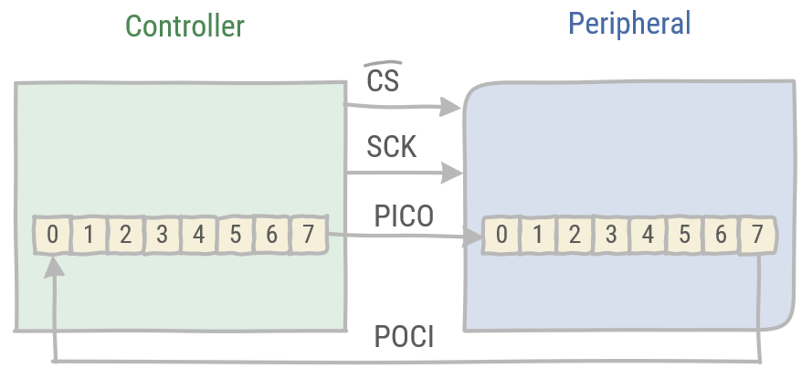
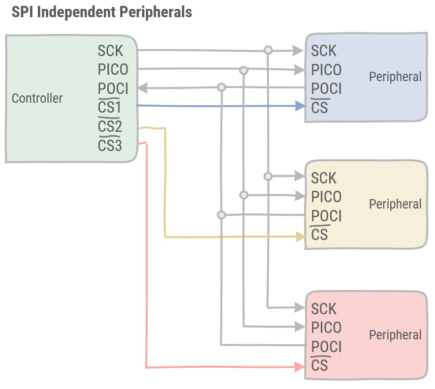
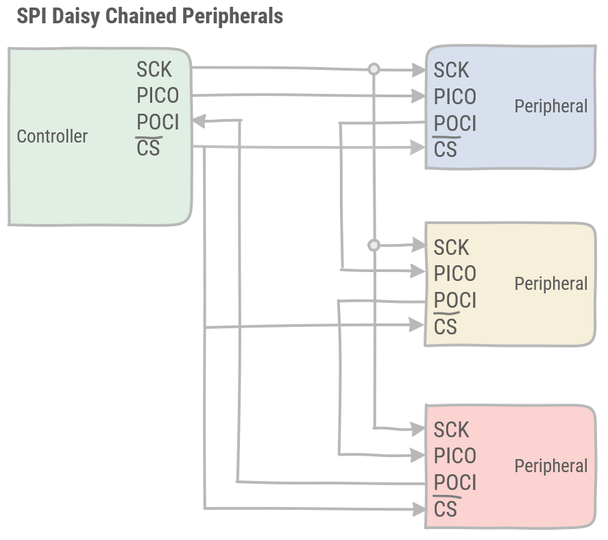

# SPI

> * What is SPI?
> * How is data transferred between a SPI controller and a peripheral?
> * How can multiple peripherals be connected to a SPI bus?

The Serial Peripheral Interface (SPI) is a 4-wire synchronous serial bus which allows for full duplex communication with a single controller. It is developed by Motorola and has become an industry standard. SPI is used to communicate between microcontrollers and peripherals in short-distance communication, either on a the PCB or between multiple PCB's.

:::tip Signal names
The Open Source Hardware Association has taken the initiative to update the names used in SPI communication. In this course we will follow the new signal names, but a lot of datasheets and other references still use the old names. Therefore, a small overview:

| Name | Function | Deprecated |
| --- | --- | --- |
| CS or CE | Chip Select or Chip enable  | SS: Slave Select |
| PICO | Peripheral In Controller Out | MOSI: Master Out Slave In |
| POCI | Peripheral Out Controller In | MISO: Master In Slave Out|

:::

## Data Transfer

The SPI controller is responsible for generating the clock signal (SCK) for all peripherals. This clock signal will also determine its data rate. This clock signal is not determined by the standard and is rather determined the slowest peripheral on the SPI bus. Also the chip select signal is generated by the controller, usually through a GPIO pin. This signal is usually active low, which means a `0` will activate the peripheral, while a `1` is the default off state.

The controller and peripherals in SPI contain an internal FIFO (First In First Out). These FIFOs are connected in a round robin fashion through the PICO and POCI lines. Note that the PICO pin of the controller will be connected to the PICO pin of the peripheral and the POCI pins of both will be connected as well.

Upon selecting the peripheral, data will be transferred from one to the next FIFO in the same time frame. Thus enabling full duplex communication.

Data is read on the rising or falling edge of the SCK signal, while data is latched on the opposite edge of the SCK signal. This ensures the timing needed to stabilize the data signals on the POCI and PICO lines.

## Multiple peripherals

There are two possiblities to connect multiple peripherals to a single SPI bus. SPI supports either connecting peripherals independently or connecting these in a daisy chain.

### Independent peripherals

With independent peripherals, each peripheral has its dedicated Chip Select signal coming from the controller. All peripherals receive the same data on the PICO pins, but the controller decides which one may read and send its buffer on its POCI pin.

### Daisy chained peripherals

In this configuration, SPI peripherals are daisy chained, connecting the POCI of one peripheral to the PICO of the next peripheral. The last peripheral in the chain is connected to the controller. There is only a single CS signal, which has to be timed correctly in order to select the wanted peripheral. As data traverses over the whole daisy chain, each peripheral has its own time slot. This timing is the responsibility of the controller, as the CS is controlled there.

The daisy chained peripherals have the advantage over the independent peripherals of requiring less pins and less lines to connect all peripherals on the bus. However, the independent peripherals are faster and easier to control.
