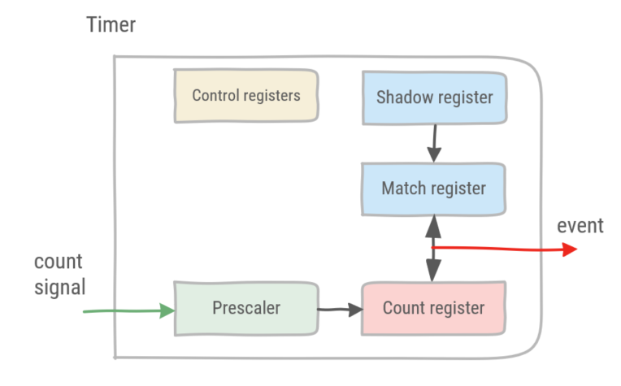
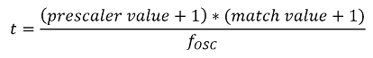
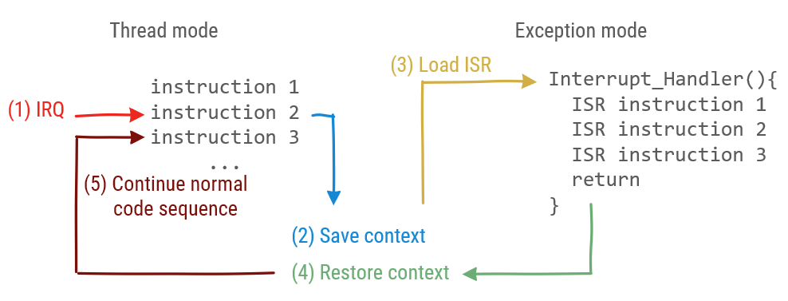
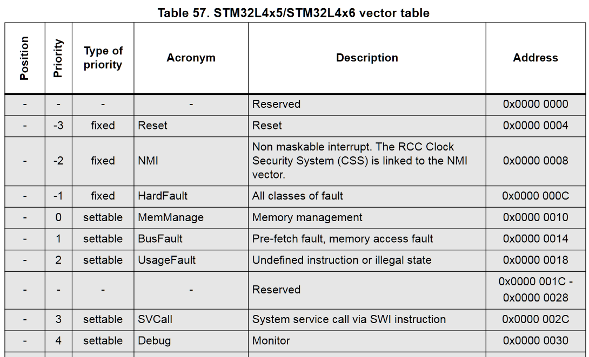

# Timers

Every microcontroller has timer peripherals. Timers are used to generate precision timing events, which do not involve the processor. In order to achieve this, interrupts are used.

## Basic Timer

Timers are hardware peripherals in a microcontroller which increment an internal value at a given input signal.

Timers have three functions:

1. Use the timer as an internal clock to time an activity, such as delaying or a time-triggered event. Pulse-Width Modulation (PWM) control is such an application.
1. Capture the activity of an external signal, i.e. how long does it take for a given signal to change under certain conditions. 
1. Counting the activity of an external signal, e.g. how many pulses can be counted in a given time-frame.

### Components of a timer

In essence, timers consist of a count register, prescaler and match register.

* The count register represents the internal value of the timer, which is incremented each clock cycle or sometimes decremented.
* The prescaler is a divider before the count register. A prescaler combined with the count register, increases the range of the timer. For instance, given a 16-bit count register, values up to 2^16 can be represented. Adding a 16-bit prescaler increases the range of the timer to 2^32.
* The match register sets the threshold value of the timer. When the count register reaches the match value, an update event is generated.

:::warning
The processor can update the match value asynchronously from the timer, even when the timer is running. In order to avoid any glitches, a shadow register is used to store the value until the actual match register can be safely updated with a new value.
:::



:::tip
Some timers do not have a match register. Rather, they decrement the count register and upon reaching the value 0, an event is generated.
:::

### Timer example (without interrupts)

The STM32L476RG microcontroller has 12 timers, excluding watchdog timers. TIM7 is a basic 16-bit timer, with a 16-bit prescaler. In the following example, the approx_wait function will be replaced with a timer-based wait, using a fixed period of 1s.

TIM7 has 8 registers, see pages 1174-1178 of the RM0351.

* TIM7_CR1 (control register)
  * UIFREMAP: control whether to copy the interrupt flag in the count register
  * ARPE: control whether the match register has to be automatically reloaded
  * OPM: control to stop counting when count reaches match
  * URS and UDIS: control to enable slave mode controller (with multiple timers)
  * CEN: starts the counter
* TIM7_CR2 (control register)
  * MMS: select master mode (multiple timers)
* TIM7_DIER (interrupt enable register)
  * UDA: DMA requests enable
  * UIE: interrupt enable
* TIM7_SR (status register)
  * UIF: interrupt flag, this flag has to be cleared by the processor to acknowledge the interrupt
* TIM7_EGR (event generation register)
  * UG: control to reinitialize the timer counter and prescaler after the update event
* TIM7_CNT (count register)
  * This register contains the count value of the timer
* TIM7_PSC (prescaler)
  * The prescaler divides the clock frequency by the value+1. Whereas the value is placed in the prescaler register
* TIM7_ARR (match register)
  * When the count register and the match register value match, an update event is generated

Configuring TIM7 requires the following steps:

1. Enable TIM7 in AHB2ENR
1. Set prescaler and match values
1. Set event generation, re-initializing the timer counter upon the update event
1. Start the timer

In order to wait synchronously, check the interrupt flag bit until it has been set. Do not forget to clear the interrupt flag bit to acknowledge the update event.

:::tip
To calculate the values of the prescaler and match register, the oscillator frequency used to drive the timer has to be known. Then the period is determined by:



For instance, given a AHB clock frequency of 48MHz, to obtain a period of 1s, the denominator should equate to 48 000 000. Thus values 1999 and 23999 can be chosen. Keep in mind that both the prescaler and match register are 16 bit register, this these values cannot exceed 2^16. More information on timing control of the microcontroller can be found in RM0351 chapter 6.
:::

```cpp
// includes low level peripheral definitions
#include "stm32l476xx.h"

/**
 * Initializes PA5 as a digital output
 * */
void led_init(){
    //Enable GPIOA peripheral in the AHB2ENR: set bit 0
    RCC->AHB2ENR |= 1;

    // GPIOA_MODER set GP output mode: reset bit 11 & set bit 10
    GPIOA->MODER &= ~(1 << 11);
    GPIOA->MODER |= 1 << 10;
}

/**
  * toggles PA5
  * */
void led_toggle(){
    // read current state of pin 5
    if(GPIOA->ODR & (1<<5)){
        //GPIOA_BSRR reset pin 5: set bit 21
        GPIOA->BSRR |= 1 << 21;
    }
    else {
        //GPIOA_BSRR set pin 5: set bit 5
        GPIOA->BSRR |= 1 << 5;
    }
}

/**
 * Initializes timer 7 for a period of 1s
 * */
void tim7_init(){
    //Enable TIM7 in the APB1ENR1: set bit 5
    RCC->APB1ENR1 |= 1 << 5;

    // Given a clock of 48MHz, set prescaler and count register for a period of 1s
    TIM7->PSC = 1999;
    TIM7->ARR = 23999;

    // Set event generation, 
    // re-initializes timer counter 
    // and generates an update of the registers
    TIM7->EGR |= 1;
}

int main()
{    
    led_init();

    tim7_init();

    // Start the timer
    TIM7->CR1 |= 1;

    while (true)
    {
        // wait until the interrupt flag has been set
        while (!(TIM7->SR & 1));
        // clear the interrupt flag
        TIM7->SR = 0;

        led_toggle();
    }
}

```

## Interrupts

In the previous example, the processor is continuously checking whether the interrupt flag has been set. This is not an efficient use of processor cycles. In an ideal world, the processor would be spending its processing cycles on something else and would be notified when the timer is done.

An external signal which notifies the processor, is called an interrupt. Rather than synchronously checking the interrupt flag, the interrupt signal will interrupt the processor, executing a special function called the Interrupt Service Routine (ISR) or interrupt handler. After the ISR has been executed, the program counter of the processor branches back to the instruction that has been interrupted, to continue its execution.

:::tip
Interrupts are not exclusively used by timers. In fact, any hardware peripheral in the microcontroller uses interrupts to offload the processor.
:::

There is a distinction between instructions executed in thread mode and instructions executed in exception mode. Thread mode is normal processor operation. Exception mode is used to execute code related to an exception. Interrupts are a specific type of exceptions. The reset signal, internal problems in the microcontroller (hardfaults), or memory management faults also cause an exception and are not considered to be interrupts. Each peripheral has its own interrupt to distinguish between interrupts.

When an Interrupt Request (IRQ) event occurs the interrupt flag is raised. Then, the processor saves the context. This is similar to what happens when a function is called. Keep in mind, the context consists the program counter and other registers.

Next, the program counter is loaded with the address of the Interrupt Service Routine (ISR), also known as the interrupt handler. When the interrupt handler is finished, the context which was interrupted is restored before continuing normal operation in thread mode. In the interrupt handler software is responsible for clearing the interrupt flag.



The Nested Vectored Interrupt Controller (NVIC) is the hardware responsible for handling interrupts for the processor. More specifically masking interrupts, setting priority and loading the program counter with the correct address. Interrupts have to be enabled individually in the NVIC. 

:::tip
Every exception has a priority. Interrupts with a lower priority cannot interrupt the exception handler of an exception with a higher priority. Table 57 of the RM0351 gives an overview of all exceptions and their priority. The priority of most exceptions can be changed. Note: Non Maskable Interrupts are interrupts related to safety-critical code. These cannot be interrupted even by hardware errors of the microcontroller itself.


:::

### Timer example (with interrupts)

In order to enable interrupts in our previous example, two peripherals must enable interrupt generation. Namely the NVIC and the peripheral generating the interrupt. These are added to the function initializing timer 7.

```cpp
void tim7_init(){
    //Enable TIM7 in the APB1ENR1: set bit 5
    RCC->APB1ENR1 |= 1 << 5;

    // Enable the global interrupt for TIM7 in NVIC
    NVIC_EnableIRQ(TIM7_IRQn);

    // Given a clock of 48MHz, set prescaler and count register for a period of 1s
    TIM7->PSC = 1999;
    TIM7->ARR = 23999;

    // Set event generation, 
    // re-initializes timer counter
    // and generates an update of the registers
    TIM7->EGR |= 1;

    // Enable interrupt in TIM7
    TIM7->DIER |= 1;
}
```

Next, the code in the loop is moved to the interrupt handler. The interrupt handler of timer 7 must be placed at the address in the program memory associated with it. This address will be loaded by the NVIC when the interrupt signal is raised.

:::tip
Fortunately, in the startup code of the microcontroller, all interrupt handlers have already been defined at the correct program memory addresses. These are functions which have been weakly defined.

A weak definition of a function means that the compiler will replace the symbol in the progam's symbol table if a non-weak function with the same name is also defined. The non-weak function definition takes precedence over the weak function definition. Instead the non-weak definition takes its place in the program memory.

To discover which symbols have already been defined in a binary, a Linux cli tool such as **nm** can be used. **W** means the symbol is weakly defined, **T** indicates a non-weak definition of the symbol.

```bash
$ nm tim7.elf
--partial output
08000f89 W TIM1_BRK_TIM15_IRQHandler
08000f89 W TIM1_CC_IRQHandler
08000f89 W TIM1_TRG_COM_TIM17_IRQHandler
08000f89 W TIM1_UP_TIM16_IRQHandler
08000f89 W TIM2_IRQHandler
08000f89 W TIM3_IRQHandler
08000f89 W TIM4_IRQHandler
08000f89 W TIM5_IRQHandler
08000f89 W TIM6_DAC_IRQHandler
08000295 T TIM7_IRQHandler
08000f89 W TIM8_BRK_IRQHandler
08000f89 W TIM8_CC_IRQHandler
08000f89 W TIM8_TRG_COM_IRQHandler
08000f89 W TIM8_UP_IRQHandler
08001ef1 T TIM_Base_SetConfig
```

:::

Thus the timer 7 interrupt handler is defined as follows:

```cpp
extern "C" {
    // Interrupt handler is called when the interrupt has been raised
    void TIM7_IRQHandler(){
        // clear TIM 7 interrupt flag
        TIM7->SR = 0;
        
        if(GPIOA->ODR & (1<<5)){
            //GPIOA_BSRR reset pin 5: set bit 21
            GPIOA->BSRR |= 1 << 21;
        }
        else {
            //GPIOA_BSRR set pin 5: set bit 5
            GPIOA->BSRR |= 1 << 5;
        }
    }
}
```

The interrupt handler is placed in an extern "C" block. All IRQ handlers are weakly defined by the startup code as C functions. As C has different function calling conventions then C++, the code block has to be marked as extern C.

Upon calling the ISR, the first thing is to clear the interrupt flag. If the interrupt flag is not cleared in software, upon leaving the ISR the interrupt would be thrown again, as the interrupt flag is (still) raised.

Then the ISR logic follows. In this simple example, a led is toggled.

:::warning
There are some guidelines in writing an ISR:

1. The ISR must be kept as short as possible. As long as the ISR is active, other interrupts with a lower priority will be ignored. This way, interrupts might be missed.
1. Do not include blocking code (code which waits, a while loop checking a flag, etc.)
1. Do not assign memory in an ISR, i.e. **new** or **malloc**. Memory allocation is not re-entrant, calling the malloc function or a constructor from an ISR will lead to memory corruption.
:::

### Mbed Ticker

The Mbed library has an abstraction of the timer as an event generator. The Mbed class is named [Ticker](https://os.mbed.com/docs/mbed-os/v6.5/apis/ticker.html).

```cpp
#include "mbed.h"

Ticker t;
DigitalOut led1(LED1);

void toggle()
{
    led1 = !led1;
}

int main()
{
    led1 = 1;
    //register the function called by the ISR and set the wait period
    t.attach(&toggle, 2s); 

    while (1) {
        //wait here for interrupts    
    }
}
```

In this example the toggle function is called every 2 seconds. The Ticker class has an attach method. In this method, the time period is set and the function to be called is registered. 

:::tip
A function pointer is the address of a function. With the reference operator **&**, the address of a function can be retrieved and assigned to a function pointer.
:::
