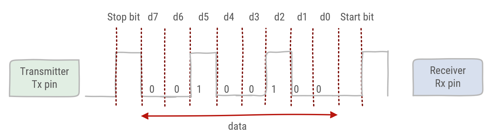
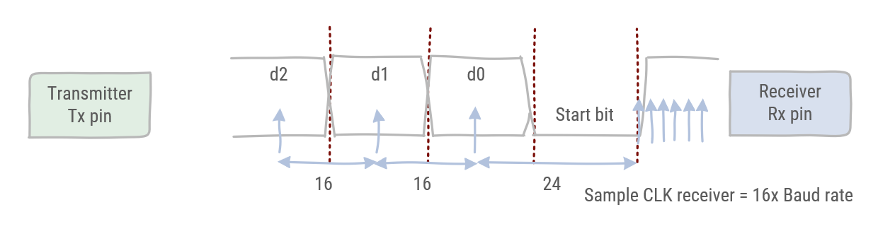

# UART

2 classes of devices

* Data Terminal Equipment (DTE)
* Data Circuit-terminating Equipment (DCE)

Input in one type of device is output in the other & vice versa

Important pins

* TxD: Transmit
* RxD: Receive
* Common Ground

The UART standard also defines other pins for flow control (see DB9 connector).

Bit rates: 75, 110, 300, 1200, 2400, 4800, 9600, 19200, 38400, 57600, 115200, ...

RS232 standard defines voltage levels:

* `1` = -3V to -25V
* `0` = 3V to 25V

## Universal Asynchronous Receiver Transmitter (UART)

A UART is a piece of hardware used to IMPLEMENT RS-232 (though there have been UARTs used for other protocols as well). ... RS232 is a serial communication protocol, a UART (Universal Asynchronous Receiver Transmitter) is a hardware device to implement serial communications.

* Half or full duplex
* Physical layer: Frame: 1 start bit, 8 data bits, 1 optional parity bit, 1 stop bit
* 8N1 (without parity) -> 1 ASCII character per 10 Bd/s
* Some devices might send a different number of data and stop bits
* LSB first



## Synchronization

The UART is asynchronous which means the internal clock signals of receiver and transmitter must be synchronized during communication  
Starting in the idle state the receiver *samples* its RX signal until it detects a high-low transition. Then, it waits 1.5 bit periods to sample its RX signal at what it estimates to be the center of data bit 0. The receiver then samples RX at bit-period intervals until it has read the remaining 7 data bits and the stop bit. From that point this process is repeated.

Successful extraction of the data from a frame requires that, over 10.5 bit periods, the drift of the receiver clock relative to the transmitter clock be less than 0.5 periods in order to correctly detect the stop bit.



## Serial Communication with Mbed

The `BufferedSerial` class provides UART functionality. We recommend you use this class for serial data transfers. You can use it to send and receive bytes of data in a sequence using separate transmit (TX) and receive pins (RX). A device can interface with another device (such as sensors, printers or another board) to exchange data or to send text to be displayed on a text-based computer interface.

Serial channels have the following characteristics:

* TX and RX pins - you can specify either pin as Not Connected (NC) for simplex (unidirectional) communication or both as valid pins for full duplex (bidirectional) communication.
* Baud rate - predefined speed at which data is sent and received on the UART interface. Standard baud rates include 9600, 19200 and 115200.

Data is transmitted using packets of configurable sizes divided in different sections, which include:

* Start bit: indicates the start of UART data transmission.
* Data frame: can be 5 to 8 (or 9 if a parity bit is not used) bits for the actual data being transferred.
* Parity bit: optional bit, used for data error detection.
* Stop bits: 1-2 bits to signal the end of a data packet.

To transmit multiple bytes, the class uses an intermediary buffer to store the bytes to send and monitors the serial interface to transfer them to the hardware buffer as soon as it is available.

### Writing to BufferedSerial

For writing to a `BufferedSerial` device, the `write()` function can be used. To fill the buffer with data, the `sprintf` function that works just like `printf` can be used. It accepts the same formatters but will write its output to a buffer instead of standard output. `sprintf` will also return the number of bytes written to the buffer.

::: warning Writing to Console
For demonstrational purpose we are using the USB UART here but it can be any UART port of the mbed system
:::

```cpp
#include "mbed.h"

static BufferedSerial pc(USBTX, USBRX, 115200);
DigitalOut alive(LED1);

const uint8_t MAXIMUM_BUFFER_SIZE = 32;

int main() {
    printf("Starting Serial Output Demo\n");

    // The buffer to store the bytes in that will be written
    char buffer[MAXIMUM_BUFFER_SIZE] = {0};

    // Write string and integer to buffer
    uint8_t length = sprintf(buffer, "%s %d\n", "Hello World", 123);

    // Write buffer to the BufferedSerial device
    pc.write(buffer, length);

    while (true) {
      ThisThread::sleep_for(chrono::seconds(1));
      alive = !alive;
    }
}
```

Should result in the output:

```text
Starting Serial Output Demo
Hello World 123
```

### Reading from BufferedSerial

Reading from a `BufferedSerial` is also quitte straight-forward using the `read()` function. It accepts a buffer and tries to fill it with the received data.

::: warning Reading from Console
For demonstrational purpose we are using the USB UART here but it can be any UART port of the mbed system
:::

```cpp
#include "mbed.h"

static BufferedSerial pc(USBTX, USBRX, 115200);

const uint8_t MAXIMUM_BUFFER_SIZE = 32;

int main() {
  printf("Starting Serial Input Demo\n");

  // Application buffer to receive the data
  char buffer[MAXIMUM_BUFFER_SIZE] = {0};

  while (true) {
    printf("\nPlease enter something\n");

    // Read some bytes from the serial device
    uint8_t numberOfBytesRead = pc.read(buffer, MAXIMUM_BUFFER_SIZE);

    printf("\nReceived %d bytes: %s\n", numberOfBytesRead, buffer);

    // Adding some delay here as in real-world app we would require
    // some time to process input + want to show that the data is
    // buffered internally
    ThisThread::sleep_for(chrono::seconds(1));
  }
}
```

```text
Starting Serial Input Demo

Please enter something
1
Received: 1

Please enter something
q
Received: q
wertyu
Please enter something

Received: wertyu

Please enter something
```
