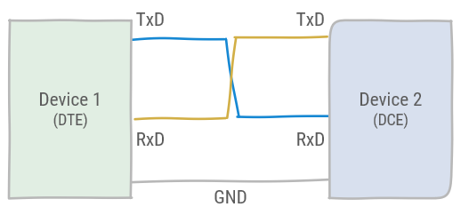
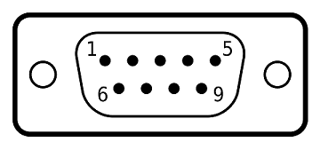

# UART

> * What is an UART?
> * What is RS-232?
> * How are the UART pins connected?
> * What are the voltage levels of RS-232?
> * What are the parts of an UART data frame?
> * What is a Baud rate?

## Universal Asynchronous Receiver Transmitter (UART)

The Universal Asynchronous Receiver Transmitter (UART) is a hardware device for asynchronous serial communication. The UART communication protocol is already in use since the first computers to communicate with teletypewriters and modems.  

## RS-232

RS-232 is a standard for the electrical specification and timing of serial communication of data.

:::tip UART vs RS-232
While RS-232 is the electrical and timing specification and UART is the hardware device, as these are often used in the same context, they are often incorrectly conflated.
:::

It defines communication between two devices, the Data Terminal Equipment (DTE) and the Data Circuit-terminating Equipment (DCE). The UART device does not need to adhere to the RS-232 standard, other standards such as RS-485. Input in one type of device is output in the other & vice versa. Although RS-232 has defined a lot of functionality, it can be reduced to a 3-wire protocol:

* TxD: Transmit
* RxD: Receive
* Common Ground



As the TxD and RxD of each device are connected to eachother, full duplex communication is possible. However, this is not a typical use-case in UART communication, and messages are typically sent consequently. The RS-232 standard also defines other pins for flow control. However, these are optional.

RS-232 also defines standard connectors, DB9 was the most commonly used for the serial port of a computer.



A serial cable for the DB9 connector is typically a crossover for communication between a DCE and a DTE. However, for communication between two devices of the same type a *null modem* cable was used.

RS-232 standard defines voltage levels:

* `1` = -3V to -15V
* `0` = 3V to 15V

As this include negative voltage levels, typically a level converter IC is used to connect a microcontroller to the serial bus. An example of such an IC is the MAX232.

## UART communication

Data frames in UART are defined by the start bit and 1 or more stop bits. It also allows for a parity bit. This is a checksum of the data bits which allows to detect bit errors. Data is sent over the UART with the Least Significant Bit (LSB) first.


Although some devices might send a different number of data and stop bits, most of the times the UART communication protocol is defined by **8N1**. This stands for 8 data bits, no parity and 1 stop bit. With 8N1, the effective data, namely ASCII characters, are sent with 10 Baud.

:::tip Bit rate and Baud rate
In UART communication the communication speed is typically defined as a certain Baud rate. The Baud rate is the frequency at which the data symbols are sent from the transmitter, defined as a number of symbols per second. As the digital data is sent without any encoding the Baud rate is essentially the same as the bit rate. Namely the bit is the symbol being sent.
:::

Typical Baud rates are: 75, 110, 300, 1200, 2400, 4800, 9600, 19200, 38400, 57600 and 115200.

## Synchronization

The UART is asynchronous which means the internal clock signals of receiver and transmitter must be synchronized during communication  
Starting in the idle state the receiver *samples* its RX signal until it detects a high-low transition. Then, it waits 1.5 bit periods to sample its RX signal at what it estimates to be the center of data bit 0. The receiver then samples RX at bit-period intervals until it has read the remaining 7 data bits and the stop bit. From that point this process is repeated.

Successful extraction of the data from a frame requires that, over 10.5 bit periods, the drift of the receiver clock relative to the transmitter clock be less than 0.5 periods in order to correctly detect the stop bit.


## Serial Communication with Mbed

The `BufferedSerial` class provides UART functionality. We recommend you use this class for serial data transfers. You can use it to send and receive bytes of data in a sequence using separate transmit (TX) and receive pins (RX). A device can interface with another device (such as sensors, printers or another board) to exchange data or to send text to be displayed on a text-based computer interface.

Serial channels have the following characteristics:

* TX and RX pins - you can specify either pin as Not Connected (NC) for simplex (unidirectional) communication or both as valid pins for full duplex (bidirectional) communication.
* Baud rate - predefined speed at which data is sent and received on the UART interface. Standard baud rates include 9600, 19200 and 115200.

Data is transmitted using packets of configurable sizes divided in different sections, which include:

* Start bit: indicates the start of UART data transmission.
* Data frame: can be 5 to 8 (or 9 if a parity bit is not used) bits for the actual data being transferred.
* Parity bit: optional bit, used for data error detection.
* Stop bits: 1-2 bits to signal the end of a data packet.

To transmit multiple bytes, the class uses an intermediary buffer to store the bytes to send and monitors the serial interface to transfer them to the hardware buffer as soon as it is available.

### Writing to BufferedSerial

For writing to a `BufferedSerial` device, the `write()` function can be used. To fill the buffer with data, the `sprintf` function that works just like `printf` can be used. It accepts the same formatters but will write its output to a buffer instead of standard output. `sprintf` will also return the number of bytes written to the buffer.

::: warning Writing to Console
For demonstration purposes we are using the USB UART here but it can be any UART port of the mbed system
:::

```cpp
#include "mbed.h"

static BufferedSerial pc(USBTX, USBRX, 115200);
DigitalOut alive(LED1);

const uint8_t MAXIMUM_BUFFER_SIZE = 32;

int main() {
    printf("Starting Serial Output Demo\n");

    // The buffer to store the bytes in that will be written
    char buffer[MAXIMUM_BUFFER_SIZE] = {0};

    // Write string and integer to buffer
    uint8_t length = sprintf(buffer, "%s %d\n", "Hello World", 123);

    // Write buffer to the BufferedSerial device
    pc.write(buffer, length);

    while (true) {
      ThisThread::sleep_for(chrono::seconds(1));
      alive = !alive;
    }
}
```

Should result in the output:

```text
Starting Serial Output Demo
Hello World 123
```

### Reading from BufferedSerial

Reading from a `BufferedSerial` is also quitte straight-forward using the `read()` function. It accepts a buffer and tries to fill it with the received data.

::: warning Reading from Console
For demonstration purposes we are using the USB UART here but it can be any UART port of the mbed system
:::

```cpp
#include "mbed.h"

static BufferedSerial pc(USBTX, USBRX, 115200);

const uint8_t MAXIMUM_BUFFER_SIZE = 32;

int main() {
  printf("Starting Serial Input Demo\n");

  // Application buffer to receive the data
  char buffer[MAXIMUM_BUFFER_SIZE] = {0};

  while (true) {
    printf("\nPlease enter something\n");

    // Read some bytes from the serial device
    uint8_t numberOfBytesRead = pc.read(buffer, MAXIMUM_BUFFER_SIZE);

    printf("\nReceived %d bytes: %s\n", numberOfBytesRead, buffer);

    // Adding some delay here as in real-world app we would require
    // some time to process input + want to show that the data is
    // buffered internally
    ThisThread::sleep_for(chrono::seconds(1));
  }
}
```

```text
Starting Serial Input Demo

Please enter something
1
Received: 1

Please enter something
q
Received: q
wertyu
Please enter something

Received: wertyu

Please enter something
```
